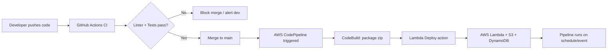

# Day 46 Masterclass: CI/CD for Data Pipelines

**Course:** Data Engineering  
**Duration:** 60 minutes  
**Format:** Instructor-led, hands-on  
**Prerequisites:** Git basics, Python fundamentals, AWS account (read access minimum), GitHub account, Cursor with **GitHub MCP** and **AWS MCP** enabled  

> **Live demo:** A fully provisioned demo with MCP walkthrough is in [`demo/MCP-DEMO-GUIDE.md`](demo/MCP-DEMO-GUIDE.md).  
> GitHub repo: https://github.com/manangupta12/data-pipeline-cicd-demo

---

## Learning Objectives

By the end of this session, learners will be able to:

1. Explain CI vs CD in the context of data pipelines
2. Read and write basic GitHub Actions YAML workflows
3. Automate linting and unit tests on every `git push`
4. Deploy validated code to AWS Lambda using **AWS CodePipeline** (Source → Build → Deploy)
5. Describe how CI/CD reduces bugs in ETL/ELT workloads
6. Use **GitHub MCP** and **AWS MCP** to inspect pipeline state and deployed resources
7. Answer common CI/CD interview questions confidently

---

## Session Agenda (60 Minutes)


| Time      | Segment        | Activity                                          |
| --------- | -------------- | ------------------------------------------------- |
| 0:00–0:10 | Concepts       | CI, CD, and why data pipelines need automation    |
| 0:10–0:18 | YAML Basics    | Syntax walkthrough with a minimal workflow        |
| 0:18–0:35 | Hands-on Lab 1 | Build a GitHub Actions CI workflow (lint + tests) |
| 0:35–0:48 | Hands-on Lab 2 | Deploy with **AWS CodePipeline** (GitHub → CodeBuild → Lambda) |
| 0:48–0:55 | MCP Demo       | Inspect GitHub commits and CodePipeline execution state |
| 0:55–1:00 | Interview Prep | Q&A and key takeaways                             |


---

## Part 1: Concepts of Automation (10 min)

### The Data Pipeline Problem

A typical data pipeline touches multiple systems:

```
Source (S3/API/DB) → Transform (Lambda/Glue/Spark) → Destination (Warehouse/Lake)
```

Manual deployment risks:

- Broken schema changes reaching production tables
- Untested transformation logic corrupting downstream metrics
- Environment drift (dev works, prod fails)
- Slow rollback when a nightly job fails at 2 AM

**CI/CD automates quality gates and deployments so humans review logic—not repetitive release steps.**

### CI: Continuous Integration

> Automatically **build and test** code every time it is pushed to Git.

For data engineering, CI typically runs:

- **Linters** (PEP8/style) on Python ETL scripts
- **Unit tests** on transformation functions
- **SQL validation** (dbt tests, schema checks)
- **Dependency/security scans**

**Analogy:** A factory quality inspector checks every part *before* it enters the assembly line.

### CD: Continuous Deployment / Delivery


| Term                      | Meaning                                                                             |
| ------------------------- | ----------------------------------------------------------------------------------- |
| **Continuous Delivery**   | Code is always in a deployable state; a human approves the final push to production |
| **Continuous Deployment** | Every passing build is **automatically** deployed to production—no manual gate      |


```
CI  →  Test & validate on every commit
CD  →  Move validated artifacts to cloud (Lambda, Glue, Airflow, ECS, etc.)
```

### CI/CD in Our Course Project

This repo already contains a serverless ETL Lambda:

```
lambda/etl_customer/lambda_function.py
```

It reads a CSV from S3 and writes records to DynamoDB—a minimal but realistic data pipeline unit we will put under CI/CD today.



### Hybrid CI/CD Pattern (Used in This Masterclass)

| Layer | Tool | Responsibility |
|-------|------|----------------|
| **CI** | GitHub Actions | Fast feedback on PRs—lint + unit tests before merge |
| **CD** | AWS CodePipeline | AWS-native orchestration—build artifact and deploy Lambda after merge |

> **Why not deploy from GitHub Actions?** You can—but in AWS-heavy data teams, **CodePipeline** gives a visual release workflow, native Lambda deploy actions, manual approval stages, and a single audit trail inside AWS. Many enterprises run **GitHub Actions for CI** and **CodePipeline for CD**.


### Instructor Talking Points

- **Data pipelines are code.** Treat ETL scripts like application code.
- **Fast feedback loops** catch bad joins, null handling bugs, and schema mismatches early.
- **Reproducibility:** The same commit hash should produce the same deployed artifact.

---

## Part 2: YAML Basics (8 min)

GitHub Actions workflows are YAML files in `.github/workflows/`.

### Core Syntax Rules

```yaml
# Comments start with #
key: value              # string
count: 42               # number
enabled: true           # boolean
items:                  # list
  - first
  - second
config:                 # nested map
  region: us-east-1
  retries: 3
```

### Anatomy of a Workflow

```yaml
name: CI for Data Pipeline          # Human-readable workflow name

on:                                 # Trigger(s)
  push:
    branches: [main]
  pull_request:
    branches: [main]

jobs:                               # One or more jobs
  validate:                         # Job ID
    runs-on: ubuntu-latest          # Runner OS
    steps:                          # Sequential steps
      - uses: actions/checkout@v4
      - name: Run linter
        run: pip install flake8 && flake8 .
```

### Key Concepts


| YAML Key  | Purpose                                             |
| --------- | --------------------------------------------------- |
| `on`      | When the workflow runs (push, PR, schedule, manual) |
| `jobs`    | Parallel or sequential units of work                |
| `runs-on` | GitHub-hosted runner image                          |
| `steps`   | Individual commands or actions                      |
| `uses`    | Reusable action from GitHub Marketplace             |
| `run`     | Shell command                                       |
| `env`     | Environment variables                               |
| `secrets` | Encrypted values (AWS keys, tokens)                 |


### Data Pipeline–Specific Triggers

```yaml
on:
  push:
    paths:
      - 'lambda/**'           # Only run when pipeline code changes
      - 'tests/**'
  schedule:
    - cron: '0 6 * * 1'       # Weekly smoke test (Monday 6 AM UTC)
```

---

## Part 3: Hands-on Lab 1 — CI with Lint + Unit Tests (20 min)

### Lab Goal

Create a GitHub Actions workflow that runs **flake8** (PEP8 linter) and **pytest** on every push.

### Step 1: Scaffold the Repository

**Instructor demo (terminal):**

```bash
cd /path/to/your/data-pipeline-repo
mkdir -p tests .github/workflows
```

### Step 2: Add a Testable ETL Module

Refactor logic into testable functions. Create `lambda/etl_customer/transform.py`:

```python
"""Pure transformation logic — easy to unit test without AWS."""


def clean_email(email: str) -> str:
    return email.strip().lower()


def row_to_item(row: dict, source_key: str) -> dict:
    return {
        "customer_id": row["customer_id"],
        "name": row["name"].strip(),
        "email": clean_email(row["email"]),
        "city": row["city"].strip(),
        "source_key": source_key,
    }
```

Create `tests/test_transform.py`:

```python
from lambda.etl_customer.transform import clean_email, row_to_item


def test_clean_email_normalizes_case_and_whitespace():
    assert clean_email("  User@Example.COM  ") == "user@example.com"


def test_row_to_item_maps_fields():
    row = {
        "customer_id": "C001",
        "name": "  Alice  ",
        "email": "ALICE@EXAMPLE.COM",
        "city": "  NYC  ",
    }
    item = row_to_item(row, "data/customer.csv")
    assert item["customer_id"] == "C001"
    assert item["name"] == "Alice"
    assert item["email"] == "alice@example.com"
    assert item["city"] == "NYC"
    assert item["source_key"] == "data/customer.csv"
```

Create `requirements-dev.txt`:

```text
flake8==7.1.1
pytest==8.3.4
boto3==1.35.0
```

### Step 3: Create the CI Workflow

Create `.github/workflows/ci-data-pipeline.yml`:

```yaml
name: CI - Data Pipeline

on:
  push:
    branches: [main, develop]
    paths:
      - 'lambda/**'
      - 'tests/**'
      - '.github/workflows/**'
  pull_request:
    branches: [main]

jobs:
  lint-and-test:
    name: Lint and Unit Tests
    runs-on: ubuntu-latest

    steps:
      - name: Checkout code
        uses: actions/checkout@v4

      - name: Set up Python
        uses: actions/setup-python@v5
        with:
          python-version: '3.12'

      - name: Install dependencies
        run: |
          python -m pip install --upgrade pip
          pip install -r requirements-dev.txt

      - name: PEP8 lint (flake8)
        run: flake8 lambda tests --max-line-length=100 --exclude=__pycache__

      - name: Unit tests (pytest)
        run: pytest tests/ -v
```

### Step 4: Break It on Purpose (Teaching Moment)

**Learner exercise (2 min):**

1. Introduce a lint violation (e.g., unused import) or a failing assertion.
2. Push to a branch and open a PR.
3. Observe the red ❌ check on GitHub.

**Instructor script:**

> "This is CI doing its job. The pipeline never reached AWS because we caught the defect in under 2 minutes."

### Step 5: Fix and Merge

Revert the intentional bug, push again, confirm green ✅ checks, then merge.

### Expected Outcome

- Every push runs automated quality gates
- PRs cannot be merged (if branch protection is enabled) until CI passes
- Data transformation logic is validated without touching S3 or DynamoDB

---

## Part 4: Hands-on Lab 2 — CD with AWS CodePipeline (13 min)

### Lab Goal

After code merges to `main`, **AWS CodePipeline** automatically builds a Lambda deployment package and deploys it to your ETL function.

> **Note:** The Lambda deploy action requires a **V2 pipeline**. See [Tutorial: Lambda function deployments with CodePipeline](https://docs.aws.amazon.com/codepipeline/latest/userguide/tutorials-lambda-deploy.html).

### Architecture

```
GitHub (main branch)
    │
    ▼  Source stage — CodeStar Connections
CodeBuild
    │  lint → test → zip artifact
    ▼
Lambda Deploy action
    │  update-function-code + publish version
    ▼
etl-customer-pipeline (alias: prod)
```

### Step 1: Add `buildspec.yml` for CodeBuild

Create `buildspec.yml` at the repo root:

```yaml
version: 0.2

phases:
  install:
    runtime-versions:
      python: 3.12
    commands:
      - pip install --upgrade pip
      - pip install -r requirements-dev.txt

  pre_build:
    commands:
      - echo "Running CI checks inside CodePipeline..."
      - flake8 lambda tests --max-line-length=100 --exclude=__pycache__
      - pytest tests/ -v

  build:
    commands:
      - echo "Packaging Lambda deployment artifact..."
      - cd lambda/etl_customer
      - zip -r ../../function.zip .
      - cd ../..

artifacts:
  files:
    - function.zip
  name: etl-customer-artifact
```

**Teaching point:** CodeBuild is the **build server** inside AWS. The same lint/test commands from Lab 1 now run as part of the release pipeline—not just on PRs.

### Step 2: Prepare the Lambda Function

Before creating the pipeline, the target Lambda must exist with a **published version** and **alias** (required for CodePipeline Lambda deploy):

1. Create function `etl-customer-pipeline` (Python 3.12, handler `lambda_function.lambda_handler`).
2. Publish version `1`.
3. Create alias `prod` pointing to version `1`.

**Instructor demo (AWS MCP):**

```
Using AWS MCP, run:
aws lambda get-function --function-name etl-customer-pipeline --region us-east-1
```

### Step 3: Create the CodePipeline (Console Walkthrough)

**Pipeline name:** `data-pipeline-etl-cd`

| Stage | Provider | Configuration |
|-------|----------|---------------|
| **Source** | GitHub (via CodeStar Connection) | Repo, branch `main`, change detection enabled |
| **Build** | AWS CodeBuild | Project using `buildspec.yml`; Linux build image |
| **Deploy** | AWS Lambda | Function: `etl-customer-pipeline`, Alias: `prod`, Deploy strategy: *Code update* |

**CodeStar Connection setup (one-time):**

1. AWS Console → Developer Tools → **Settings → Connections**.
2. Create connection to GitHub; authorize AWS.
3. Select that connection in the Source stage.

**CodeBuild project settings:**

| Setting | Value |
|---------|-------|
| Environment | Managed image, Ubuntu, Standard runtime |
| Service role | Auto-created or existing CodeBuild role |
| Buildspec | Use `buildspec.yml` from source |
| Artifacts | Passed to next stage (CodePipeline default) |

### Step 4: Add Manual Approval (Continuous Delivery Demo)

Insert an **Approval** stage between Build and Deploy:

```
Source → Build → Approval → Deploy
```

**Instructor script:**

> "This is **Continuous Delivery**—the artifact is ready, but a human must approve before production Lambda updates. Remove the Approval stage for **Continuous Deployment**."

### Step 5: Trigger and Verify

1. Merge a small change to `lambda/etl_customer/` on `main`.
2. Open **CodePipeline** console → watch stages turn green.
3. Confirm Lambda `LastModified` updated.

**Expected console flow:**

```
Source (Succeeded) → Build (Succeeded) → Approval (Approved) → Deploy (Succeeded)
```

### AWS Resources Required (Instructor Setup)

| Resource | Example Name | Purpose |
|----------|--------------|---------|
| Lambda function | `etl-customer-pipeline` | ETL target with alias `prod` |
| CodePipeline | `data-pipeline-etl-cd` | Orchestrates Source → Build → Deploy |
| CodeBuild project | `etl-customer-build` | Runs lint, tests, packages zip |
| CodeStar Connection | `github-connection` | Secure GitHub source integration |
| S3 artifact bucket | Auto-created by CodePipeline | Stores build artifacts between stages |
| IAM roles | CodePipeline + CodeBuild service roles | Lambda deploy permissions on pipeline role |

### IAM Permissions Highlight

The CodePipeline service role needs Lambda deploy permissions. Minimum actions for the deploy stage:

- `lambda:UpdateFunctionCode`
- `lambda:PublishVersion`
- `lambda:UpdateAlias`
- `lambda:GetFunction`

See [Lambda deploy action reference](https://docs.aws.amazon.com/codepipeline/latest/userguide/action-reference-LambdaDeploy.html).

### Optional: GitHub Actions CD (Alternative Pattern)

Teams that prefer all automation in GitHub can deploy directly from Actions using OIDC. This masterclass uses CodePipeline for CD, but the alternative workflow is documented in [Deploying Lambda with GitHub Actions](https://docs.aws.amazon.com/lambda/latest/dg/deploying-github-actions.html).

```yaml
# .github/workflows/cd-deploy-lambda.yml — OPTIONAL alternative to CodePipeline
name: CD - Deploy ETL Lambda (GitHub Actions alternative)

on:
  push:
    branches: [main]
    paths:
      - 'lambda/etl_customer/**'

permissions:
  id-token: write
  contents: read

jobs:
  deploy:
    runs-on: ubuntu-latest
    environment: production
    steps:
      - uses: actions/checkout@v4
      - uses: aws-actions/configure-aws-credentials@v4
        with:
          role-to-assume: ${{ secrets.AWS_DEPLOY_ROLE_ARN }}
          aws-region: us-east-1
      - run: cd lambda/etl_customer && zip -r function.zip .
      - run: aws lambda update-function-code --function-name etl-customer-pipeline --zip-file fileb://lambda/etl_customer/function.zip
```

### Continuous Delivery vs Continuous Deployment — Live Demo

| Pattern | CodePipeline Configuration | Behavior |
|---------|---------------------------|----------|
| **Continuous Delivery** | Approval stage before Deploy | Human approves in AWS Console |
| **Continuous Deployment** | No Approval stage | Merge to `main` → auto-deploy |

---

## Part 5: MCP Hands-on Demo (7 min)

Use Cursor MCP servers to **observe** the pipeline and deployment without leaving the IDE.

### Demo A: GitHub MCP — Inspect Commits and Workflow Files

**Prompt to Cursor (read-only inspection):**

```
Using GitHub MCP, list the last 5 commits on main for owner <YOUR_GITHUB_USER> repo data-pipeline-cicd-demo.
Show which files changed in the latest commit.
```

**MCP tools used:**


| Tool                   | Purpose                                                   |
| ---------------------- | --------------------------------------------------------- |
| `list_commits`         | Verify CI was triggered by the latest push                |
| `get_file_contents`    | Read `.github/workflows/ci-data-pipeline.yml` from remote |
| `search_pull_requests` | Find open PRs and their check status context              |


**Instructor narrative:**

> "GitHub MCP lets you audit repository state programmatically—the same way a platform engineer would build internal tooling."

### Demo B: GitHub MCP — Push Workflow Files (Instructor Only)

If bootstrapping a demo repo live:

```
Using GitHub MCP push_files, create branch main with:
- .github/workflows/ci-data-pipeline.yml
- tests/test_transform.py
- requirements-dev.txt
Commit message: "Add CI workflow for data pipeline"
```

**MCP tool:** `push_files` — pushes multiple files in a single commit.

### Demo C: AWS MCP — Verify CodePipeline and Lambda Deployment

**Prompt to Cursor:**

```
Using AWS MCP, run:
aws codepipeline get-pipeline-state --name data-pipeline-etl-cd --region us-east-1

Summarize the latest execution status for each stage (Source, Build, Deploy).
```

**Follow-up prompt:**

```
Using AWS MCP, run:
aws lambda get-function --function-name etl-customer-pipeline --region us-east-1

Did LastModified change after the latest pipeline run?
```

**MCP tools used:**

| Tool | Purpose |
|------|---------|
| `aws___call_aws` | `codepipeline get-pipeline-state`, `codepipeline list-pipeline-executions`, `lambda get-function` |
| `aws___search_documentation` | Look up CodePipeline Lambda deploy and CodeBuild buildspec guides |
| `aws___read_documentation` | Read official Lambda deploy tutorial |

**Follow-up documentation prompt:**

```
Search AWS documentation for "CodePipeline Lambda deploy GitHub source"
and summarize the required pipeline type and alias setup.
```

**Expected teaching point:** CodePipeline state is inspectable via CLI/MCP—the same visibility SRE teams use when a nightly ETL deploy fails.

### Demo D: End-to-End Trace

Walk through the chain aloud while running MCP queries:

```
1. list_commits              → "Who pushed what and when?"
2. GitHub Actions UI         → "Did CI pass before merge?"
3. aws___call_aws            → "codepipeline get-pipeline-state — did CD run?"
4. aws___call_aws            → "lambda get-function — did LastModified change?"
5. aws___call_aws            → "dynamodb scan --table-name etl-test --max-items 3"
```

---

## Reference: Complete File Tree After Labs

```
data-pipeline-cicd-demo/
├── .github/
│   └── workflows/
│       └── ci-data-pipeline.yml      # CI only (lint + tests on PR/push)
├── buildspec.yml                     # CodeBuild: lint, test, package zip
├── lambda/
│   └── etl_customer/
│       ├── lambda_function.py
│       └── transform.py
├── tests/
│   └── test_transform.py
├── requirements-dev.txt
└── README.md
```

**AWS resources (not in repo):**

- CodePipeline `data-pipeline-etl-cd`
- CodeBuild project `etl-customer-build`
- CodeStar Connection to GitHub
- Lambda `etl-customer-pipeline` with alias `prod`

---

## Interview Questions & Model Answers

### 1. What is the difference between Continuous Delivery and Continuous Deployment?

**Answer:**

Both require CI so code is always tested and packaged. The difference is the **final promotion step**:

- **Continuous Delivery:** Production release is a **manual or approval-gated** step. The pipeline produces a proven artifact; a human (or change-advisory process) decides when to deploy.
- **Continuous Deployment:** Every change that passes the pipeline **automatically** goes to production with no extra approval.

**Data engineering example:** A dbt project might use Continuous Delivery so analytics lead approves warehouse schema changes, while a low-risk metrics Lambda might use Continuous Deployment.

---

### 2. How does CI/CD help in reducing bugs in a data pipeline?

**Answer:**

CI/CD reduces bugs by shifting validation **left** (earlier in the lifecycle):


| Without CI/CD                            | With CI/CD                                        |
| ---------------------------------------- | ------------------------------------------------- |
| Bugs found during nightly production run | Bugs found on every commit in minutes             |
| Hard to know which commit broke the job  | Exact commit and test failure pinpoint root cause |
| Manual, inconsistent test execution      | Same lint/test suite every time                   |
| Slow rollback                            | Redeploy last known-good artifact quickly         |


Concrete data pipeline examples:

- Unit tests catch bad casts (`"N/A"` → integer) before Glue/Lambda jobs run
- Schema contract tests prevent loading wrong columns into fact tables
- Idempotency tests ensure reruns do not duplicate fact rows
- Deployment automation eliminates "wrong zip uploaded" human errors

---

### 3. Explain the role of a build server in a CI/CD pipeline.

**Answer:**

A **build server** (or CI runner—e.g., GitHub Actions runner, Jenkins agent, AWS CodeBuild) is the machine that **executes automation** when code changes:

1. **Checkout** source code from Git
2. **Build** artifacts (zip Lambda package, Docker image, wheel)
3. **Run** tests, linters, security scans
4. **Publish** artifacts to a registry (S3, ECR, Artifactory)
5. **Trigger** deployment stages

It provides a **clean, consistent, isolated environment** so "works on my laptop" does not drive production behavior. In this masterclass:

- **GitHub Actions** (`runs-on: ubuntu-latest`) is the CI build server for PR checks.
- **AWS CodeBuild** is the build server inside CodePipeline—it packages the Lambda zip after merge.
- **AWS CodePipeline** orchestrates the release stages and deploy action.

---

## Instructor Cheat Sheet

### Common Learner Mistakes


| Mistake | Fix |
|---------|-----|
| Workflow not triggering | Check `on.push.paths` filters and branch names |
| `flake8` not found | Add `pip install -r requirements-dev.txt` step |
| Tests pass locally, fail in CI | Pin dependency versions; check Python version matrix |
| CodePipeline Source stage fails | Verify CodeStar Connection status is `Available` |
| CodeBuild fails on `buildspec.yml` | Confirm file is at repo root; check YAML indentation |
| Lambda deploy fails | Ensure V2 pipeline, published version, and alias exist |
| Lambda deploy succeeds but old code runs | Confirm deploy action targets correct function + alias |
| Artifact not passed to Deploy stage | Check CodeBuild `artifacts` section outputs `function.zip` |


### Branch Protection Recommendation

Enable on `main`:

- Require status check: `Lint and Unit Tests`
- Require PR reviews
- Block force pushes

### Optional Extension (Homework)

- Add `moto`-based integration tests mocking S3 and DynamoDB
- Add `dbt test` or Great Expectations validation stage
- Add Slack notification on workflow failure
- Multi-environment CD: `dev` auto-deploy, `prod` approval gate

---

## Key Takeaways (Closing Slide)

1. **CI** = automatic test on every push (GitHub Actions); **CD** = orchestrated deploy in AWS (CodePipeline).
2. **YAML workflows** in `.github/workflows/` define CI; **`buildspec.yml`** defines CodeBuild steps.
3. **CodePipeline stages:** Source → Build → (Approval) → Deploy—ideal for AWS-native data pipeline releases.
4. **Separate transform logic** from AWS I/O so unit tests stay fast and reliable.
5. **MCP tools** help inspect Git commits, CodePipeline state, and Lambda deployment from one interface.
6. Data pipelines fail expensively in production—CI/CD is insurance, not overhead.

---

## Appendix A: Quick Local Commands (Pre-class Verification)

```bash
# Run the same checks locally before pushing
pip install -r requirements-dev.txt
flake8 lambda tests --max-line-length=100
pytest tests/ -v
```

## Appendix B: MCP Tool Reference

### GitHub MCP (`user-github-personal`)


| Tool                    | Demo Use                                |
| ----------------------- | --------------------------------------- |
| `get_me`                | Confirm authenticated GitHub user       |
| `push_files`            | Bootstrap demo repo with workflow files |
| `create_or_update_file` | Update a single workflow file           |
| `list_commits`          | Show recent pushes that triggered CI    |
| `get_file_contents`     | Read workflow YAML from GitHub          |
| `search_pull_requests`  | Find PRs awaiting green checks          |
| `create_pull_request`   | Demo PR-based workflow                  |


### AWS MCP (`user-aws-mcp`)


| Tool                         | Demo Use                                                |
| ---------------------------- | ------------------------------------------------------- |
| `aws___call_aws` | `codepipeline get-pipeline-state`, `codepipeline list-pipeline-executions`, `lambda get-function`, `s3 ls` |
| `aws___search_documentation` | Find CodePipeline Lambda deploy and CodeBuild guides |
| `aws___read_documentation`   | Read full AWS doc pages                                 |
| `aws___list_regions`         | Show regional deployment options                        |
| `aws___get_tasks`            | Poll long-running async AWS operations                  |


## Appendix C: Further Reading

- [Tutorial: Lambda function deployments with CodePipeline](https://docs.aws.amazon.com/codepipeline/latest/userguide/tutorials-lambda-deploy.html)
- [AWS Lambda deploy action reference](https://docs.aws.amazon.com/codepipeline/latest/userguide/action-reference-LambdaDeploy.html)
- [CodeBuild buildspec reference](https://docs.aws.amazon.com/codebuild/latest/userguide/build-spec-ref.html)
- [Using GitHub Actions to deploy Lambda functions](https://docs.aws.amazon.com/lambda/latest/dg/deploying-github-actions.html) *(alternative CD pattern)*
- [GitHub Actions workflow syntax](https://docs.github.com/en/actions/using-workflows/workflow-syntax-for-github-actions)

---

*Day 46 — Week 10, Day 1 — Data Engineering Course*