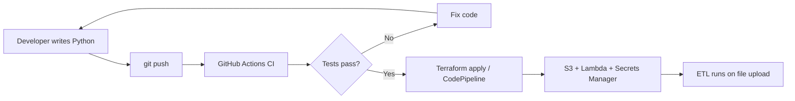

# Day 50 Walkthrough: Infrastructure as Code, Serverless & End-to-End Review

**Course:** Data Engineering — Week 10, Day 5  
**Time:** ~45–60 minutes  
**Goal:** See how Python ETL code moves from your laptop to AWS using Git, CI/CD, IaC, and Lambda.

---

## What you will learn

1. **Infrastructure as Code (IaC)** — define S3 buckets and Lambda with Terraform or CloudFormation instead of clicking in the console
2. **Serverless ETL** — run small jobs on AWS Lambda without managing EC2 servers
3. **End-to-end workflow** — Code → Git → CI/CD → Cloud (S3 + optional RDS)
4. **Secrets Manager** — store database passwords securely (never in source code)
5. **Interview answers** — ready-made responses for common questions

---

## Before you start

| Item | Your value (fill in) |
|------|----------------------|
| AWS region | `________________` (e.g. `us-east-1`) |
| Unique project prefix | `________________` (lowercase, e.g. `student-jane-2026`) |
| GitHub username | `________________` |

**Prerequisites:**

- Python 3.12+
- Git installed
- AWS account (free tier OK for S3 + Lambda)
- Optional: [Terraform](https://developer.hashicorp.com/terraform/install) installed

---

## Part 1: Understand the big picture (5 min)

Modern data pipelines follow a repeatable path:

```
Write Code (Python)  →  Version Control (Git)  →  Automate (CI/CD)  →  Deploy (AWS)
```

In this project:

| Step | Tool | What happens |
|------|------|--------------|
| Write | Python in `lambda/etl_orders/` | Transform CSV rows into clean JSON records |
| Version | Git + GitHub | Every change is tracked and reviewable |
| Automate | GitHub Actions | Lint + unit tests run on every push |
| Deploy | Terraform / CodePipeline | S3 buckets, Lambda, Secrets Manager created in AWS |
| Run | Lambda (serverless) | Reads CSV from S3 raw bucket → writes JSON to processed bucket |



---

## Part 2: Explore the project (10 min)

Open the folder `day50-iac-serverless-wrapup/` and skim these files:

### Python ETL code

| File | Purpose |
|------|---------|
| `lambda/etl_orders/transform.py` | Pure functions — easy to unit test |
| `lambda/etl_orders/lambda_function.py` | AWS entry point — reads S3, writes S3 |
| `lambda/etl_orders/db_config.py` | Loads DB password from Secrets Manager |
| `data/orders.csv` | Sample input data |
| `tests/` | Proves transform logic works without AWS |

**Key idea:** Business logic lives in `transform.py`. Lambda only handles AWS wiring (S3 read/write).

### Infrastructure as Code

| Folder | Tool | Creates |
|--------|------|---------|
| `infra/terraform/` | **Terraform** (HCL) | S3 buckets, Lambda, IAM, Secrets Manager, optional RDS |
| `infra/cloudformation/etl-stack.yaml` | **CloudFormation** (YAML) | Same concepts, AWS-native syntax |

Both tools answer: *"What should exist in my AWS account?"* You check the answer into Git, run `plan`/`validate`, then `apply`/`deploy`.

---

## Part 3: Run locally — no AWS needed (10 min)

```bash
cd day50-iac-serverless-wrapup
chmod +x scripts/local-test.sh
./scripts/local-test.sh
```

Or step by step:

```bash
pip install -r requirements-dev.txt
flake8 lambda tests --max-line-length=100
pytest tests/ -v
```

**Expected:** All tests pass. You just ran the same checks GitHub Actions will run in the cloud.

### What the tests prove

- `test_transform.py` — amounts, dates, and currency are normalized correctly
- `test_db_config.py` — secret loading logic works (mocked, no real AWS call)

---

## Part 4: Infrastructure as Code — Terraform (15 min)

### Why IaC?

| Manual console clicks | Infrastructure as Code |
|-----------------------|------------------------|
| Hard to reproduce | Same code → same infrastructure every time |
| No audit trail | Git history shows who changed what |
| Drift over time | `terraform plan` shows differences |
| Slow for teams | Review IaC in pull requests |

### Step 1 — Configure variables

```bash
cd infra/terraform
cp terraform.tfvars.example terraform.tfvars
```

Edit `terraform.tfvars`:

```hcl
project_prefix = "your-unique-prefix"   # must be globally unique for S3
aws_region     = "us-east-1"
environment    = "dev"
enable_rds     = false                  # keep false to avoid RDS charges
```

### Step 2 — Preview changes (safe — creates nothing yet)

```bash
terraform init
terraform plan
```

Read the plan output. You should see resources like:

- `aws_s3_bucket.raw` — incoming CSV storage
- `aws_s3_bucket.processed` — transformed JSON output
- `aws_lambda_function.etl_orders` — serverless ETL function
- `aws_secretsmanager_secret.db_credentials` — secure password storage

### Step 3 — Create infrastructure (optional — uses AWS)

```bash
terraform apply
```

Type `yes` when prompted. Save the outputs:

```bash
terraform output raw_bucket_name
terraform output processed_bucket_name
terraform output lambda_function_name
terraform output db_secret_arn
```

### Step 4 — Test the pipeline

Upload the sample CSV:

```bash
aws s3 cp ../../data/orders.csv s3://YOUR-RAW-BUCKET/incoming/orders.csv
```

Check processed output:

```bash
aws s3 ls s3://YOUR-PROCESSED-BUCKET/processed/ --recursive
```

Download and inspect the JSON file — you should see cleaned order records.

### Clean up (avoid ongoing charges)

```bash
terraform destroy
```

---

## Part 5: CloudFormation — same idea, different syntax (5 min)

CloudFormation is AWS's built-in IaC tool. Open `infra/cloudformation/etl-stack.yaml` and compare to Terraform:

| Concept | Terraform | CloudFormation |
|---------|-----------|----------------|
| S3 bucket | `resource "aws_s3_bucket" "raw"` | `Type: AWS::S3::Bucket` |
| Lambda | `aws_lambda_function` | `AWS::Lambda::Function` |
| Secret | `aws_secretsmanager_secret` | `AWS::SecretsManager::Secret` |
| Deploy | `terraform apply` | `aws cloudformation deploy` |

Example deploy (creates stack with placeholder Lambda code — update via CI/CD later):

```bash
aws cloudformation deploy \
  --template-file infra/cloudformation/etl-stack.yaml \
  --stack-name day50-etl-demo \
  --parameter-overrides ProjectPrefix=your-unique-prefix \
  --capabilities CAPABILITY_NAMED_IAM
```

**Interview tip:** Terraform is cloud-agnostic and popular in multi-cloud teams. CloudFormation is AWS-native and integrates tightly with the AWS console.

---

## Part 6: Serverless — why Lambda for small ETL? (5 min)

### Lambda vs EC2 for ETL

| Factor | AWS Lambda | EC2 instance |
|--------|------------|--------------|
| Server management | None — AWS runs it | You patch, scale, monitor OS |
| Billing | Pay per invocation + duration | Pay 24/7 even when idle |
| Best for | Short jobs (seconds/minutes), event-driven | Long jobs, heavy compute, always-on |
| Scaling | Automatic | You configure Auto Scaling |
| Cold start | Small delay on first run | Always warm if instance runs |

**Use Lambda when:** file lands in S3 → quick transform → write result (this project).

**Use EC2 when:** Spark job runs 4 hours, custom libraries, or you need persistent local disk.

Our Lambda handler (`lambda_function.py`) is triggered when a `.csv` file appears under `incoming/` in the raw bucket.

---

## Part 7: Securing database passwords (5 min)

**Never do this:**

```python
# BAD — password in source code
DB_PASSWORD = "super-secret-123"
```

**Do this instead:**

1. Store credentials in **AWS Secrets Manager** (created by Terraform in `secrets.tf`)
2. Grant Lambda IAM permission: `secretsmanager:GetSecretValue`
3. Load at runtime in `db_config.py`:

```python
config = load_db_config(secret_arn=os.environ["DB_SECRET_ARN"])
# config["password"] is fetched securely at runtime
```

### Why Secrets Manager?

- Passwords are encrypted at rest
- Rotation can be automated
- Access is controlled by IAM policies
- No secrets in Git, `.env` files committed by mistake, or CloudWatch logs

The secret JSON shape used in this project:

```json
{
  "username": "etl_user",
  "password": "<auto-generated>",
  "engine": "postgres",
  "host": "mydb.xxxxx.rds.amazonaws.com",
  "port": 5432,
  "dbname": "orders"
}
```

Set `enable_rds = true` in Terraform only when you want a real RDS instance (costs money). For learning, `enable_rds = false` is enough to understand the pattern.

---

## Part 8: CI/CD — connect Git to quality gates (5 min)

File: `.github/workflows/ci-data-pipeline.yml`

On every push to `main` or `develop`:

1. Install Python dependencies
2. Run **flake8** (PEP8 lint)
3. Run **pytest** (unit tests)
4. Validate **Terraform** syntax

This is the same CI pattern from Day 46, extended with IaC checks.

**Workflow:**

```bash
git add .
git commit -m "Normalize order currency in transform"
git push origin main
```

Open GitHub → **Actions** tab → confirm the workflow passes before deploying infrastructure changes.

For full CD (auto-deploy Lambda via CodePipeline), see the Day 46 project in [`day46-cicd-data-pipelines/`](../day46-cicd-data-pipelines/).

---

## Part 9: End-to-end review checklist

Use this checklist to explain the full journey in an interview or presentation:

- [ ] **Code** — Python transform functions with unit tests
- [ ] **Git** — changes tracked, reviewed via pull request
- [ ] **CI** — GitHub Actions blocks broken code
- [ ] **IaC** — Terraform/CloudFormation defines S3, Lambda, secrets
- [ ] **Deploy** — `terraform apply` or pipeline promotes artifacts
- [ ] **Run** — S3 upload triggers Lambda ETL
- [ ] **Secure** — DB credentials in Secrets Manager, not in repo
- [ ] **Observe** — CloudWatch Logs for Lambda execution

---

## Interview prep

### Q1: What are the benefits of Infrastructure as Code?

**Sample answer:**

> Infrastructure as Code lets you define cloud resources in version-controlled files instead of manual console clicks. Benefits include reproducibility (dev/staging/prod stay consistent), faster onboarding (run one command instead of a 20-step runbook), auditability (Git blame shows who changed infrastructure), and safer reviews (terraform plan in pull requests before apply). It also reduces configuration drift because the code is the source of truth.

### Q2: When would you use AWS Lambda instead of a dedicated EC2 instance for an ETL job?

**Sample answer:**

> I'd use Lambda for short, event-driven ETL — for example when a CSV lands in S3 and I need to clean and load a few thousand rows. Lambda is cost-effective because I pay only when the job runs, and I don't manage servers. I'd choose EC2 (or EMR/Glue) when the job runs for hours, needs large memory/CPU, requires a custom runtime stack, or must stay warm for continuous streaming ingestion.

### Q3: How do you secure sensitive database passwords in a cloud environment?

**Sample answer:**

> I never store passwords in source code or plain environment variables in Git. I use AWS Secrets Manager (or Parameter Store for non-rotating config) to store credentials encrypted. The application IAM role gets least-privilege permission to read only the specific secret. At runtime the ETL job fetches the secret via the AWS SDK. I enable rotation where possible and audit access with CloudTrail. Local development uses separate secrets or SSO-based temporary credentials — never production passwords on a laptop.

---

## Troubleshooting

| Problem | Fix |
|---------|-----|
| S3 bucket name already taken | Change `project_prefix` to something globally unique |
| Terraform `validate` fails in CI | Run `terraform init -backend=false` locally first |
| Lambda not triggered | Confirm file path is `incoming/*.csv` and notification exists |
| Tests fail on import | Run from project root; `conftest.py` adds `lambda/` to path |
| RDS costs | Keep `enable_rds = false`; run `terraform destroy` when done |

---

## Key takeaways

1. **IaC** turns infrastructure into reviewable, repeatable code
2. **Lambda** is ideal for small, event-driven ETL workloads
3. **CI/CD** catches bugs before they reach production
4. **Secrets Manager** keeps database passwords out of your repository
5. The full data engineering loop: **Python → Git → CI → Cloud**

---

## Next steps

- Compare this project with Day 46's CodePipeline demo
- Try a small change to `transform.py`, push, and watch CI run
- Read [AWS Lambda pricing](https://aws.amazon.com/lambda/pricing/) vs EC2 for a cost exercise
- Explore Terraform modules for larger teams

**Project README:** [README.md](README.md)
