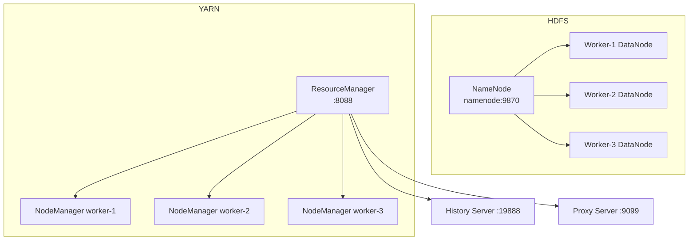

# Local Hadoop Cluster — Student Guide

**Follow this guide step by step.** You will run a multi-node Hadoop cluster on your laptop using Docker — no manual Java/Hadoop install required.

**Project folder:** `hadoop-local-docker/`  
**Time:** ~20 minutes (first run; image download takes longer)  
**Cost:** Free (runs locally)

---

## What you are building

A small Hadoop 3.3 cluster with:

| Component | What it does |
|-----------|--------------|
| **HDFS** | Distributed file storage (like S3, but local) |
| **YARN** | Resource manager — schedules MapReduce jobs |
| **MapReduce** | Batch processing framework (word count, grep, etc.) |

### Cluster layout



| Container | Role | Web UI |
|-----------|------|--------|
| `namenode` | HDFS metadata + NameNode UI | http://localhost:9870 |
| `worker-1`, `worker-2`, `worker-3` | HDFS DataNodes + YARN NodeManagers | — |
| `resourcemanager` | YARN scheduler | http://localhost:8088 |
| `historyserver` | Finished job logs | http://localhost:19888 |
| `proxyserver` | YARN application proxy | http://localhost:9099 |

**Docker image:** [neshkeev/hadoop:3.3.6-jdk-11](https://hub.docker.com/r/neshkeev/hadoop) — supports **Intel (amd64)** and **Apple Silicon (arm64)**.

---

## Choose your setup path

| OS | Recommended terminal | Start script |
|----|----------------------|--------------|
| macOS | Terminal (zsh/bash) | `./scripts/start.sh` |
| Linux | Terminal (bash) | `./scripts/start.sh` |
| Windows | **PowerShell** | `.\scripts\start.ps1` |
| Windows (alt) | **Git Bash** or **WSL 2 Ubuntu** | `./scripts/start.sh` |

> **Windows students:** Use **PowerShell** for `.ps1` scripts, or **Git Bash / WSL** for `.sh` scripts. Do not use old `cmd.exe` — it cannot run these scripts.

## Before you start — checklist

| Item | Your value / status |
|------|---------------------|
| OS | Mac / Windows / Linux |
| Docker installed and running? | ☐ |
| `docker --version` works? | ☐ |
| `docker compose version` works? | ☐ |
| At least 6 GB free RAM | ☐ |
| Required ports free (see below) | ☐ |
| In project folder `hadoop-local-docker/` | ☐ |

### Required ports

These must be free on your machine:

| Port | Service |
|------|---------|
| 8088 | YARN ResourceManager |
| 9099 | YARN Proxy |
| 9870 | HDFS NameNode UI |
| 9900 | HDFS RPC (host → container 9000) |
| 19888 | MapReduce History Server |
| 18042, 19864 | Worker 1 |
| 28042, 29864 | Worker 2 |
| 38042, 39864 | Worker 3 |

> **Why port 9900 and not 9000?** Port 9000 is commonly used by other local tools (MinIO, DynamoDB Local, etc.). We map HDFS to **9900** on your host to avoid conflicts. Inside the Docker network, services still talk to `namenode:9000`.

---

## Step 1 — Install Docker

### macOS

1. Download [Docker Desktop for Mac](https://docs.docker.com/desktop/setup/install/mac-install/)
   - **Apple Silicon (M1/M2/M3):** choose **Apple Chip**
   - **Intel Mac:** choose **Intel Chip**
2. Open Docker Desktop and wait until it says **Docker is running**
3. Verify in Terminal:

```bash
docker --version
docker compose version
```

### Windows

1. Download [Docker Desktop for Windows](https://docs.docker.com/desktop/setup/install/windows-install/)
2. Enable **WSL 2** when prompted (recommended)
3. Open **PowerShell** or **Git Bash** and verify:

```powershell
docker --version
docker compose version
```

### Linux

Use **Docker Engine + Compose plugin** (most common on Linux) or **Docker Desktop for Linux**.

1. Follow the official install guide for your distro:
   - Ubuntu: https://docs.docker.com/engine/install/ubuntu/
   - Other distros: https://docs.docker.com/engine/install/
2. Add your user to the `docker` group (avoids needing `sudo` every time):

```bash
sudo usermod -aG docker $USER
newgrp docker
```

3. Verify:

```bash
docker --version
docker compose version
docker run hello-world
```

---

## Step 2 — Get the project files

Clone the course repo:

```bash
git clone https://github.com/manangupta12/aws-data-engineering-course.git
cd aws-data-engineering-course/hadoop-local-docker
```

Windows (PowerShell):

```powershell
git clone https://github.com/manangupta12/aws-data-engineering-course.git
cd aws-data-engineering-course\hadoop-local-docker
```

You should see:

```
hadoop-local-docker/
├── docker-compose.yml      # Cluster definition
├── data/sample.txt         # Sample file for labs
├── scripts/
│   ├── lib.sh / lib.ps1    # Shared helpers
│   ├── start.sh            # Mac / Linux / Git Bash / WSL
│   ├── stop.sh
│   ├── smoke-test.sh
│   ├── verify.sh
│   ├── start.ps1           # Windows PowerShell
│   ├── stop.ps1
│   ├── smoke-test.ps1
│   └── verify.ps1
├── HADOOP-STUDENT-GUIDE.md # This file
└── README.md
```

> All commands below assume your current directory is `hadoop-local-docker/`.

---

## Step 3 — Start the cluster

### Mac / Linux / Git Bash (Windows)

```bash
chmod +x scripts/*.sh
./scripts/start.sh
```

First run downloads the Hadoop image (~1.2 GB). This can take 5–15 minutes depending on your network.

### Windows (PowerShell)

If PowerShell blocks scripts, run once:

```powershell
Set-ExecutionPolicy -Scope CurrentUser RemoteSigned
```

Then start the cluster:

```powershell
.\scripts\start.ps1
```

The start script pulls the image, starts containers, and waits until all 7 services are healthy (may take 2–3 minutes after the image download).

### Manual start (all platforms)

If scripts fail, run directly:

```bash
docker pull neshkeev/hadoop:3.3.6-jdk-11
docker compose up -d
```

---

## Step 4 — Verify the cluster is healthy

Run the verify script:

```bash
./scripts/verify.sh
```

Windows:

```powershell
.\scripts\verify.ps1
```

Or check manually:

```bash
docker compose ps
```

**Expected:** All 7 containers show `(healthy)`:

```
namenode          ... Up ... (healthy)   0.0.0.0:9870->9870/tcp, 0.0.0.0:9900->9000/tcp
resourcemanager   ... Up ... (healthy)   0.0.0.0:8088->8088/tcp
historyserver     ... Up ... (healthy)   0.0.0.0:19888->19888/tcp
proxyserver       ... Up ... (healthy)   0.0.0.0:9099->9099/tcp
worker-1          ... Up ... (healthy)
worker-2          ... Up ... (healthy)
worker-3          ... Up ... (healthy)
```

Open in browser:

| URL | What to look for |
|-----|------------------|
| http://localhost:9870 | NameNode UI — **Live Nodes: 3** |
| http://localhost:8088 | YARN — **Nodes: 3**, **Active Nodes: 3** |

If a container is not healthy yet, wait 30 seconds and run `docker compose ps` again.

---

## Step 5 — Run the smoke test

This uploads a sample file to HDFS and runs the built-in **wordcount** MapReduce job.

### Mac / Linux / Git Bash

```bash
./scripts/smoke-test.sh
```

### Windows (PowerShell)

```powershell
.\scripts\smoke-test.ps1
```

**Expected output (last lines):**

```
cluster    1
docker     1
hadoop     1
hdfs       1
hello      3
local      1
mapreduce  1

Smoke test passed.
```

If you see this, your cluster is working.

---

## Step 6 — Hands-on HDFS commands

All HDFS commands run **inside** the NameNode container.

Enter the container:

```bash
docker exec -it namenode bash
```

Inside the container:

```bash
# List root
hdfs dfs -ls /

# Create your directory
hdfs dfs -mkdir -p /user/student/input

# Upload a local file (path is inside the container)
# Tip: copy a file in first — see below
hdfs dfs -put /tmp/myfile.txt /user/student/input/

# List your files
hdfs dfs -ls /user/student/input

# Read a file
hdfs dfs -cat /user/student/input/myfile.txt

# Copy HDFS → local
hdfs dfs -get /user/student/input/myfile.txt /tmp/downloaded.txt

# Delete
hdfs dfs -rm /user/student/input/myfile.txt

# Exit container shell
exit
```

### Copy a file from your laptop into the container

**Mac / Linux:**

```bash
docker cp ./data/sample.txt namenode:/tmp/sample.txt
docker exec namenode hdfs dfs -mkdir -p /user/student/input
docker exec namenode hdfs dfs -put /tmp/sample.txt /user/student/input/sample.txt
docker exec namenode hdfs dfs -cat /user/student/input/sample.txt
```

**Windows (PowerShell):**

```powershell
docker cp .\data\sample.txt namenode:/tmp/sample.txt
docker exec namenode hdfs dfs -mkdir -p /user/student/input
docker exec namenode hdfs dfs -put /tmp/sample.txt /user/student/input/sample.txt
docker exec namenode hdfs dfs -cat /user/student/input/sample.txt
```

---

## Step 7 — Run MapReduce jobs

### Word count (from host, no shell needed)

**Mac / Linux / Git Bash:**

```bash
docker exec namenode bash -lc \
  'hadoop jar $(ls $HADOOP_HOME/share/hadoop/mapreduce/hadoop-mapreduce-examples-*.jar | head -1) wordcount /user/root/input/sample.txt /user/student/output/wordcount'
```

**Windows (PowerShell):**

```powershell
docker exec namenode bash -lc "hadoop jar `$(ls `$HADOOP_HOME/share/hadoop/mapreduce/hadoop-mapreduce-examples-*.jar | head -1) wordcount /user/root/input/sample.txt /user/student/output/wordcount"
```

View results:

```bash
docker exec namenode hdfs dfs -cat /user/student/output/wordcount/part-r-00000
```

### Grep example

Mac / Linux / Git Bash / WSL:

```bash
docker exec namenode hdfs dfs -rm -r -f /user/student/output/grep 2>/dev/null || true
docker exec namenode bash -lc \
  'hadoop jar $(ls $HADOOP_HOME/share/hadoop/mapreduce/hadoop-mapreduce-examples-*.jar | head -1) grep /user/root/input/sample.txt /user/student/output/grep "hello.*"'
docker exec namenode hdfs dfs -cat /user/student/output/grep/part-m-00000
```

Windows (PowerShell):

```powershell
docker exec namenode hdfs dfs -rm -r -f /user/student/output/grep
docker exec namenode bash -lc "hadoop jar `$(ls `$HADOOP_HOME/share/hadoop/mapreduce/hadoop-mapreduce-examples-*.jar | head -1) grep /user/root/input/sample.txt /user/student/output/grep `"hello.*`""
docker exec namenode hdfs dfs -cat /user/student/output/grep/part-m-00000
```

Track job progress:

- YARN UI: http://localhost:8088/cluster/apps
- History: http://localhost:19888

---

## Step 8 — YARN commands

```bash
# List worker nodes
docker exec resourcemanager yarn node -list

# List applications
docker exec resourcemanager yarn application -list

# Kill a running app (replace APP_ID)
docker exec resourcemanager yarn application -kill application_XXXXXXXXX_XXXX
```

---

## Stop and reset

### Stop cluster (keep HDFS data)

**Mac / Linux / Git Bash:**

```bash
./scripts/stop.sh
```

**Windows:**

```powershell
.\scripts\stop.ps1
```

Or:

```bash
docker compose down
```

### Full reset (delete all HDFS data)

```bash
docker compose down -v
```

Use this when you want a completely fresh cluster.

---

## Troubleshooting

### Docker is not running

**Symptom:** `Cannot connect to the Docker daemon`

**Fix:** Open Docker Desktop and wait until it is fully started.

### Port already in use

**Symptom:** `Bind for 0.0.0.0:9870 failed: port is already allocated`

**Fix:** Find what is using the port:

```bash
# Mac / Linux
lsof -i :9870

# Windows PowerShell
netstat -ano | findstr :9870
```

Stop the conflicting process, or edit `docker-compose.yml` to use a different host port (e.g. `"9871:9870"`).

### Image pull is slow or stuck

**Fix:** Pull the image once manually, then start:

```bash
docker pull neshkeev/hadoop:3.3.6-jdk-11
docker compose up -d
```

### Container not healthy

Check logs:

```bash
docker compose logs namenode
docker compose logs worker-1
docker compose logs resourcemanager
```

Restart workers:

```bash
docker compose restart worker-1 worker-2 worker-3
```

### NameNode UI shows 0 live nodes

Wait 60 seconds after start. If still 0:

```bash
docker compose restart worker-1 worker-2 worker-3
docker compose ps
```

### `NativeCodeLoader` warning

```
Unable to load native-hadoop library for your platform... using builtin-java classes
```

This is **normal** in Docker. Jobs still run correctly.

### Windows: scripts won't run

**PowerShell blocked (.ps1):**

```powershell
Set-ExecutionPolicy -Scope CurrentUser RemoteSigned
```

Then retry `.\scripts\start.ps1`.

**Other options:**

- Use **Git Bash** or **WSL 2** for `.sh` scripts
- Run `docker compose` commands directly (see Step 3 manual start)
- Ensure **Docker Desktop** is running and WSL integration is enabled (Settings → Resources → WSL integration)

### Linux: permission denied on `docker`

**Symptom:** `permission denied while trying to connect to the Docker daemon socket`

**Fix:**

```bash
sudo usermod -aG docker $USER
newgrp docker
```

Or log out and back in, then retry.

### Out of memory

**Symptom:** Containers restart or jobs fail

**Fix:** In Docker Desktop → **Settings → Resources**, allocate at least **6 GB RAM**, then restart Docker.

---

## Quick reference

| Task | Command |
|------|---------|
| Start | `./scripts/start.sh` or `.\scripts\start.ps1` |
| Verify | `./scripts/verify.sh` or `.\scripts\verify.ps1` |
| Status | `docker compose ps` |
| Smoke test | `./scripts/smoke-test.sh` or `.\scripts\smoke-test.ps1` |
| HDFS shell | `docker exec -it namenode bash` |
| Stop | `./scripts/stop.sh` or `docker compose down` |
| Fresh reset | `docker compose down -v` |
| NameNode UI | http://localhost:9870 |
| YARN UI | http://localhost:8088 |

---

## What you learned

- Run Hadoop locally without installing Java or Hadoop manually
- Use HDFS commands (`hdfs dfs`) to store and read files
- Submit MapReduce jobs through YARN
- Monitor cluster health via web UIs
- Same workflow works on **Mac, Windows, and Linux** via Docker

---

## Next steps

- Upload your own CSV/JSON to HDFS and run wordcount on it
- Explore other examples in `$HADOOP_HOME/share/hadoop/mapreduce/hadoop-mapreduce-examples-*.jar`
- Compare HDFS concepts to S3 when you work on AWS labs in this repo
