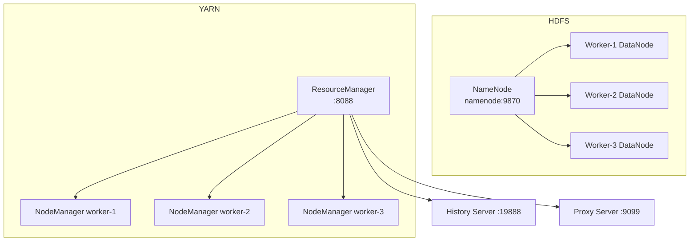

# Local Hadoop Cluster — Student Guide

**Follow this guide step by step.** You will run a multi-node Hadoop cluster on your laptop using Docker — no manual Java/Hadoop install required.

**Project folder:** `hadoop-local-docker/`  
**Time:** ~20 minutes (first run; image download takes longer)  
**Cost:** Free (runs locally)

---

## What you are building

A small Hadoop 3.3 cluster with:

| Component | What it does |
|-----------|--------------|
| **HDFS** | Distributed file storage (like S3, but local) |
| **YARN** | Resource manager — schedules MapReduce jobs |
| **MapReduce** | Batch processing framework (word count, grep, etc.) |

### Cluster layout



| Container | Role | Web UI |
|-----------|------|--------|
| `namenode` | HDFS metadata + NameNode UI | http://localhost:9870 |
| `worker-1`, `worker-2`, `worker-3` | HDFS DataNodes + YARN NodeManagers | — |
| `resourcemanager` | YARN scheduler | http://localhost:8088 |
| `historyserver` | Finished job logs | http://localhost:19888 |
| `proxyserver` | YARN application proxy | http://localhost:9099 |

**Docker image:** [neshkeev/hadoop:3.3.6-jdk-11](https://hub.docker.com/r/neshkeev/hadoop) — supports **Intel (amd64)** and **Apple Silicon (arm64)**.

---

## Choose your terminal

| OS | Recommended terminal |
|----|----------------------|
| macOS | Terminal (zsh/bash) |
| Linux | Terminal (bash) |
| Windows | **PowerShell**, **Git Bash**, or **WSL 2 Ubuntu** |

> **Windows students:** Do not use old `cmd.exe`. Use PowerShell or Git Bash/WSL for the commands below.

> All commands below assume your current directory is `hadoop-local-docker/`.

## Before you start — checklist

| Item | Your value / status |
|------|---------------------|
| OS | Mac / Windows / Linux |
| Docker installed and running? | ☐ |
| `docker --version` works? | ☐ |
| `docker compose version` works? | ☐ |
| At least 6 GB free RAM | ☐ |
| Required ports free (see below) | ☐ |
| In project folder `hadoop-local-docker/` | ☐ |

### Required ports

These must be free on your machine:

| Port | Service |
|------|---------|
| 8088 | YARN ResourceManager |
| 9099 | YARN Proxy |
| 9870 | HDFS NameNode UI |
| 9900 | HDFS RPC (host → container 9000) |
| 19888 | MapReduce History Server |
| 18042, 19864 | Worker 1 |
| 28042, 29864 | Worker 2 |
| 38042, 39864 | Worker 3 |

> **Why port 9900 and not 9000?** Port 9000 is commonly used by other local tools (MinIO, DynamoDB Local, etc.). We map HDFS to **9900** on your host to avoid conflicts. Inside the Docker network, services still talk to `namenode:9000`.

---

## Step 1 — Install Docker

### macOS

1. Download [Docker Desktop for Mac](https://docs.docker.com/desktop/setup/install/mac-install/)
   - **Apple Silicon (M1/M2/M3):** choose **Apple Chip**
   - **Intel Mac:** choose **Intel Chip**
2. Open Docker Desktop and wait until it says **Docker is running**
3. Verify in Terminal:

```bash
docker --version
docker compose version
```

### Windows

1. Download [Docker Desktop for Windows](https://docs.docker.com/desktop/setup/install/windows-install/)
2. Enable **WSL 2** when prompted (recommended)
3. Open **PowerShell** or **Git Bash** and verify:

```powershell
docker --version
docker compose version
```

### Linux

Use **Docker Engine + Compose plugin** (most common on Linux) or **Docker Desktop for Linux**.

1. Follow the official install guide for your distro:
   - Ubuntu: https://docs.docker.com/engine/install/ubuntu/
   - Other distros: https://docs.docker.com/engine/install/
2. Add your user to the `docker` group (avoids needing `sudo` every time):

```bash
sudo usermod -aG docker $USER
newgrp docker
```

3. Verify:

```bash
docker --version
docker compose version
docker run hello-world
```

---

## Step 2 — Get the project files

Clone the course repo:

```bash
git clone https://github.com/manangupta12/aws-data-engineering-course.git
cd aws-data-engineering-course/hadoop-local-docker
```

Windows (PowerShell):

```powershell
git clone https://github.com/manangupta12/aws-data-engineering-course.git
cd aws-data-engineering-course\hadoop-local-docker
```

You should see:

```
hadoop-local-docker/
├── docker-compose.yml           # Defines all 7 cluster containers
├── data/
│   ├── sample.txt               # Sample file for smoke test
│   └── ecommerce/               # E-commerce demo data (class notebook)
├── HADOOP-STUDENT-GUIDE.md      # This file
├── Hadoop-Local-Cluster-Class.ipynb
└── README.md
```

> Optional helper scripts exist in `scripts/` (`start.sh`, `verify.sh`, etc.). This guide uses **explicit commands** so you understand each step.

---

## Step 3 — Start the cluster (run commands in order)

Move into the project folder:

```bash
cd aws-data-engineering-course/hadoop-local-docker
```

Windows (PowerShell):

```powershell
cd aws-data-engineering-course\hadoop-local-docker
```

Run each command below **in sequence**. Read the *What it does* column before running the next one.

### 3.1 — Download the Hadoop Docker image

```bash
docker pull neshkeev/hadoop:3.3.6-jdk-11
```

| What it does |
|--------------|
| Downloads the pre-built Hadoop 3.3.6 image (~1.2 GB). First run can take 5–15 minutes. Same image is reused by all 7 containers. Supports Intel and Apple Silicon. |

### 3.2 — Start all cluster containers in the background

```bash
docker compose up -d
```

| What it does |
|--------------|
| Reads `docker-compose.yml` and starts 7 containers: `namenode`, `worker-1`, `worker-2`, `worker-3`, `resourcemanager`, `historyserver`, `proxyserver`. The `-d` flag runs them in the background (detached). |

### 3.3 — Check container status

```bash
docker compose ps
```

| What it does |
|--------------|
| Lists every container, its state (`Up` / `Exit`), and port mappings. Right after start, status may show `starting` before `healthy`. |

**Expected (after 1–3 minutes):** All 7 rows show `(healthy)`.

### 3.4 — Wait until every service is healthy

Re-run until all seven show `healthy`:

```bash
docker inspect --format='{{.Name}} {{.State.Health.Status}}' namenode resourcemanager historyserver proxyserver worker-1 worker-2 worker-3
```

| What it does |
|--------------|
| Queries Docker health checks for each container. Hadoop services need time to register DataNodes and YARN nodes before jobs will work. |

**Expected output:**

```
/namenode healthy
/resourcemanager healthy
/historyserver healthy
/proxyserver healthy
/worker-1 healthy
/worker-2 healthy
/worker-3 healthy
```

If any container is not `healthy` after 3 minutes, wait 30 seconds and re-run the command. See [Troubleshooting](#container-not-healthy).

### 3.5 — Confirm web UIs are reachable

Open in your browser:

| URL | What it does |
|-----|--------------|
| http://localhost:9870 | **NameNode UI** — HDFS dashboard; confirm **Live Nodes: 3** |
| http://localhost:8088 | **YARN UI** — cluster scheduler; confirm **Active Nodes: 3** |
| http://localhost:19888 | **History Server** — finished MapReduce job logs |

Optional CLI check (Mac/Linux/Git Bash):

```bash
curl -s -o /dev/null -w "%{http_code}" http://localhost:9870
curl -s -o /dev/null -w "%{http_code}" http://localhost:8088
```

| What it does |
|--------------|
| Prints `200` if the web UI is responding. On Windows, use the browser URLs instead. |

---

## Step 4 — Verify the cluster is healthy

Run these commands in order.

### 4.1 — List containers and ports

```bash
docker compose ps
```

| What it does |
|--------------|
| Shows whether each service is `Up` and which host ports map to container ports (e.g. `9870` → NameNode UI). |

### 4.2 — Check health of each container

```bash
docker inspect --format='{{.Name}} {{.State.Health.Status}}' namenode resourcemanager historyserver proxyserver worker-1 worker-2 worker-3
```

| What it does |
|--------------|
| Confirms Docker health probes passed for HDFS, YARN, and worker nodes. All must be `healthy` before running HDFS or MapReduce commands. |

### 4.3 — Confirm YARN sees 3 worker nodes

```bash
docker exec resourcemanager yarn node -list
```

| What it does |
|--------------|
| Asks the YARN ResourceManager how many NodeManagers registered. Expect **3** nodes (`worker-1`, `worker-2`, `worker-3`). |

### 4.4 — Confirm HDFS sees live DataNodes

Open http://localhost:9870 → **Datanodes** tab.

| What to look for |
|------------------|
| **Live Nodes: 3** — means all three workers registered their storage with the NameNode. |

**Expected:** All 7 containers `(healthy)` in Step 4.2, 3 YARN nodes in Step 4.3, 3 live DataNodes in Step 4.4.

---

## Step 5 — Smoke test (HDFS + MapReduce)

Run each command in order. This proves storage (HDFS) and batch processing (MapReduce via YARN) work end-to-end.

### 5.1 — Create an HDFS input directory

```bash
docker exec namenode hdfs dfs -mkdir -p /user/root/input
```

| What it does |
|--------------|
| Creates a folder in HDFS (like creating a prefix/folder in S3). The NameNode records the path; data will live on worker DataNodes. |

### 5.2 — Copy sample file from laptop into the NameNode container

Mac / Linux / Git Bash / WSL:

```bash
docker cp ./data/sample.txt namenode:/tmp/sample.txt
```

Windows (PowerShell):

```powershell
docker cp .\data\sample.txt namenode:/tmp/sample.txt
```

| What it does |
|--------------|
| Copies a local file into the `namenode` container filesystem at `/tmp/`. Required because `hdfs put` reads from inside the container. |

### 5.3 — Upload the file into HDFS

```bash
docker exec namenode hdfs dfs -put -f /tmp/sample.txt /user/root/input/sample.txt
```

| What it does |
|--------------|
| Stores the file in HDFS at `/user/root/input/sample.txt`. HDFS splits it into blocks and replicates across worker DataNodes. `-f` overwrites if the file already exists. |

### 5.4 — List and read the file from HDFS

```bash
docker exec namenode hdfs dfs -ls /user/root/input
docker exec namenode hdfs dfs -cat /user/root/input/sample.txt
```

| What it does |
|--------------|
| `ls` — lists files and replication info. `cat` — prints file contents from HDFS to your terminal. |

### 5.5 — Remove old output (safe to re-run)

```bash
docker exec namenode hdfs dfs -rm -r -f /user/root/output/wordcount
```

| What it does |
|--------------|
| Deletes previous MapReduce output so the next job does not fail with "output directory already exists". |

### 5.6 — Submit the wordcount MapReduce job

Mac / Linux / Git Bash / WSL:

```bash
docker exec namenode bash -lc \
  'hadoop jar $(ls $HADOOP_HOME/share/hadoop/mapreduce/hadoop-mapreduce-examples-*.jar | head -1) wordcount /user/root/input/sample.txt /user/root/output/wordcount'
```

Windows (PowerShell):

```powershell
docker exec namenode bash -lc "hadoop jar `$(ls `$HADOOP_HOME/share/hadoop/mapreduce/hadoop-mapreduce-examples-*.jar | head -1) wordcount /user/root/input/sample.txt /user/root/output/wordcount"
```

| What it does |
|--------------|
| Submits a batch job to YARN. **Map** tasks count words in each line; **Reduce** tasks sum counts. Output is written to `/user/root/output/wordcount/` in HDFS. Watch progress at http://localhost:8088/cluster/apps |

### 5.7 — Read the job result

```bash
docker exec namenode hdfs dfs -cat /user/root/output/wordcount/part-r-00000
```

| What it does |
|--------------|
| Prints the reduce output — one line per word with its count. |

**Expected output (last lines):**

```
cluster    1
docker     1
hadoop     1
hdfs       1
hello      3
local      1
mapreduce  1
```

If you see word counts like above, your cluster is fully working.

---

## Step 6 — Hands-on HDFS commands

All HDFS commands run **inside** the NameNode container.

Enter the container:

```bash
docker exec -it namenode bash
```

Inside the container:

```bash
# List root
hdfs dfs -ls /

# Create your directory
hdfs dfs -mkdir -p /user/student/input

# Upload a local file (path is inside the container)
# Tip: copy a file in first — see below
hdfs dfs -put /tmp/myfile.txt /user/student/input/

# List your files
hdfs dfs -ls /user/student/input

# Read a file
hdfs dfs -cat /user/student/input/myfile.txt

# Copy HDFS → local
hdfs dfs -get /user/student/input/myfile.txt /tmp/downloaded.txt

# Delete
hdfs dfs -rm /user/student/input/myfile.txt

# Exit container shell
exit
```

### Copy a file from your laptop into the container

**Mac / Linux:**

```bash
docker cp ./data/sample.txt namenode:/tmp/sample.txt
docker exec namenode hdfs dfs -mkdir -p /user/student/input
docker exec namenode hdfs dfs -put /tmp/sample.txt /user/student/input/sample.txt
docker exec namenode hdfs dfs -cat /user/student/input/sample.txt
```

**Windows (PowerShell):**

```powershell
docker cp .\data\sample.txt namenode:/tmp/sample.txt
docker exec namenode hdfs dfs -mkdir -p /user/student/input
docker exec namenode hdfs dfs -put /tmp/sample.txt /user/student/input/sample.txt
docker exec namenode hdfs dfs -cat /user/student/input/sample.txt
```

---

## Step 7 — Run MapReduce jobs

### Word count (from host, no shell needed)

**Mac / Linux / Git Bash:**

```bash
docker exec namenode bash -lc \
  'hadoop jar $(ls $HADOOP_HOME/share/hadoop/mapreduce/hadoop-mapreduce-examples-*.jar | head -1) wordcount /user/root/input/sample.txt /user/student/output/wordcount'
```

**Windows (PowerShell):**

```powershell
docker exec namenode bash -lc "hadoop jar `$(ls `$HADOOP_HOME/share/hadoop/mapreduce/hadoop-mapreduce-examples-*.jar | head -1) wordcount /user/root/input/sample.txt /user/student/output/wordcount"
```

View results:

```bash
docker exec namenode hdfs dfs -cat /user/student/output/wordcount/part-r-00000
```

### Grep example

Mac / Linux / Git Bash / WSL:

```bash
docker exec namenode hdfs dfs -rm -r -f /user/student/output/grep 2>/dev/null || true
docker exec namenode bash -lc \
  'hadoop jar $(ls $HADOOP_HOME/share/hadoop/mapreduce/hadoop-mapreduce-examples-*.jar | head -1) grep /user/root/input/sample.txt /user/student/output/grep "hello.*"'
docker exec namenode hdfs dfs -cat /user/student/output/grep/part-m-00000
```

Windows (PowerShell):

```powershell
docker exec namenode hdfs dfs -rm -r -f /user/student/output/grep
docker exec namenode bash -lc "hadoop jar `$(ls `$HADOOP_HOME/share/hadoop/mapreduce/hadoop-mapreduce-examples-*.jar | head -1) grep /user/root/input/sample.txt /user/student/output/grep `"hello.*`""
docker exec namenode hdfs dfs -cat /user/student/output/grep/part-m-00000
```

Track job progress:

- YARN UI: http://localhost:8088/cluster/apps
- History: http://localhost:19888

---

## Step 8 — YARN commands

```bash
# List worker nodes
docker exec resourcemanager yarn node -list

# List applications
docker exec resourcemanager yarn application -list

# Kill a running app (replace APP_ID)
docker exec resourcemanager yarn application -kill application_XXXXXXXXX_XXXX
```

---

## Stop and reset

### Stop cluster (keep container data)

```bash
docker compose down
```

| What it does |
|--------------|
| Stops and removes all 7 containers and the Docker network. Container filesystem data is removed, but named volumes (if any) persist. Our cluster stores HDFS data inside containers, so a full reset needs the command below. |

### Full reset (fresh cluster)

```bash
docker compose down -v
```

| What it does |
|--------------|
| Same as `down`, plus removes Docker volumes (`-v`). Use when you want a completely clean HDFS state. |

### Start again later

Repeat [Step 3](#step-3--start-the-cluster-run-commands-in-order) from `docker compose up -d`.

---

## Troubleshooting

### Docker is not running

**Symptom:** `Cannot connect to the Docker daemon`

**Fix:** Open Docker Desktop and wait until it is fully started.

### Port already in use

**Symptom:** `Bind for 0.0.0.0:9870 failed: port is already allocated`

**Fix:** Find what is using the port:

```bash
# Mac / Linux
lsof -i :9870

# Windows PowerShell
netstat -ano | findstr :9870
```

Stop the conflicting process, or edit `docker-compose.yml` to use a different host port (e.g. `"9871:9870"`).

### Image pull is slow or stuck

**Fix:** Pull the image once manually, then start:

```bash
docker pull neshkeev/hadoop:3.3.6-jdk-11
docker compose up -d
```

### Container not healthy

Check logs:

```bash
docker compose logs namenode
docker compose logs worker-1
docker compose logs resourcemanager
```

Restart workers:

```bash
docker compose restart worker-1 worker-2 worker-3
```

### NameNode UI shows 0 live nodes

Wait 60 seconds after start. If still 0:

```bash
docker compose restart worker-1 worker-2 worker-3
docker compose ps
```

### `NativeCodeLoader` warning

```
Unable to load native-hadoop library for your platform... using builtin-java classes
```

This is **normal** in Docker. Jobs still run correctly.

### Windows: command issues

- Use **PowerShell** or **Git Bash** — not `cmd.exe`
- For `docker cp`, use `.\data\sample.txt` on Windows paths
- Ensure **Docker Desktop** is running with WSL integration enabled (Settings → Resources → WSL integration)

### Linux: permission denied on `docker`

**Symptom:** `permission denied while trying to connect to the Docker daemon socket`

**Fix:**

```bash
sudo usermod -aG docker $USER
newgrp docker
```

Or log out and back in, then retry.

### Out of memory

**Symptom:** Containers restart or jobs fail

**Fix:** In Docker Desktop → **Settings → Resources**, allocate at least **6 GB RAM**, then restart Docker.

---

## Quick reference

| Step | Command | Purpose |
|------|---------|---------|
| Pull image | `docker pull neshkeev/hadoop:3.3.6-jdk-11` | Download Hadoop image |
| Start | `docker compose up -d` | Start 7 containers |
| Status | `docker compose ps` | List container state |
| Health | `docker inspect --format='{{.Name}} {{.State.Health.Status}}' namenode resourcemanager historyserver proxyserver worker-1 worker-2 worker-3` | Check all services |
| YARN nodes | `docker exec resourcemanager yarn node -list` | Confirm 3 workers |
| HDFS shell | `docker exec -it namenode bash` | Interactive Hadoop shell |
| Stop | `docker compose down` | Stop cluster |
| Fresh reset | `docker compose down -v` | Stop + remove volumes |
| NameNode UI | http://localhost:9870 | HDFS dashboard |
| YARN UI | http://localhost:8088 | Job scheduler dashboard |

---

## Class notebook — 1-hour guided lab

**File:** [`Hadoop-Local-Cluster-Class.ipynb`](./Hadoop-Local-Cluster-Class.ipynb)

Instructor-led Jupyter notebook for a **60-minute live class**. Walks through every container with a fictional e-commerce company called **ShopStream** (orders, reviews, clickstream).

> **Students:** Complete [Steps 1–5](#step-1--install-docker) first so the cluster is running before opening the notebook.

### What the notebook covers

| Topic | Containers / services | E-commerce example |
|-------|----------------------|-------------------|
| Why Hadoop | Architecture overview | Store & batch-process millions of orders overnight |
| Health check | All 7 containers | Verify "data center" is online before jobs |
| HDFS storage | `namenode`, `worker-1/2/3` | Upload `orders.csv`, `product_reviews.txt`, `clickstream.csv` to `/shopstream/raw/` |
| YARN scheduling | `resourcemanager`, workers | Shift manager assigns batch jobs to analyst desks |
| MapReduce | YARN + HDFS | Word count on product reviews; grep for "delivery" complaints |
| Job audit | `historyserver`, `proxyserver` | Review finished job logs & app tracking URLs |
| AWS mapping | — | HDFS → S3, YARN+MR → EMR |

### Class agenda (60 min)

| Time | Topic | Demo |
|------|-------|------|
| 0–8 min | Why Hadoop for e-commerce | ShopStream story + architecture diagram |
| 8–12 min | Cluster health check | `docker compose ps`, all 7 healthy |
| 12–22 min | HDFS — NameNode + DataNodes | Upload e-commerce files to HDFS |
| 22–32 min | YARN — ResourceManager + workers | `yarn node -list`, YARN UI :8088 |
| 32–45 min | MapReduce | Wordcount on reviews, grep demo |
| 45–52 min | History + Proxy servers | :19888 job logs, :9099 proxy |
| 52–60 min | Batch pipeline + AWS | Nightly ETL diagram, S3/EMR comparison |

### Sample data (ShopStream)

| File | Path | Used for |
|------|------|----------|
| Orders | `data/ecommerce/orders.csv` | HDFS upload demo — 15 sample orders |
| Reviews | `data/ecommerce/product_reviews.txt` | MapReduce wordcount |
| Clickstream | `data/ecommerce/clickstream.csv` | HDFS upload — page views, cart, checkout events |

HDFS paths created in the notebook:

```
/shopstream/raw/orders/
/shopstream/raw/reviews/
/shopstream/raw/clickstream/
/shopstream/processed/          ← MapReduce output
```

### Run the notebook

**Prerequisite:** Cluster healthy ([Step 3](#step-3--start-the-cluster-run-commands-in-order) + [Step 4](#step-4--verify-the-cluster-is-healthy)).

**1. Install Jupyter (one time):**

```bash
cd aws-data-engineering-course/hadoop-local-docker
python3 -m venv .venv
source .venv/bin/activate          # Windows: .venv\Scripts\activate
pip install -r requirements-notebook.txt
```

**2. Open browser tabs before class:**

| UI | URL |
|----|-----|
| NameNode | http://localhost:9870 |
| YARN | http://localhost:8088 |
| History Server | http://localhost:19888 |

**3. Start Jupyter:**

```bash
jupyter notebook Hadoop-Local-Cluster-Class.ipynb
```

Windows (PowerShell) — same commands after activating `.venv`.

**4. Run cells top to bottom** during class. Markdown cells = teach; code cells = live demo (`!docker exec ...`).

### Container quick map (teaching cheat sheet)

| Container | Role | Port | ShopStream analogy |
|-----------|------|------|-------------------|
| `namenode` | HDFS catalog | 9870, 9900 | Inventory catalog desk |
| `worker-1/2/3` | DataNode + NodeManager | 18042/28042/38042 | Warehouse racks + analyst desks |
| `resourcemanager` | YARN scheduler | 8088 | Shift manager |
| `historyserver` | Job history | 19888 | Completed shift reports |
| `proxyserver` | App proxy | 9099 | Reception / job gateway |

---

## What you learned

- Run Hadoop locally without installing Java or Hadoop manually
- Use HDFS commands (`hdfs dfs`) to store and read files
- Submit MapReduce jobs through YARN
- Monitor cluster health via web UIs
- Same workflow works on **Mac, Windows, and Linux** via Docker

---

## Next steps

- Walk through the [**1-hour class notebook**](./Hadoop-Local-Cluster-Class.ipynb) with the ShopStream e-commerce demos
- Upload your own CSV/JSON to HDFS and run wordcount on it
- Explore other examples in `$HADOOP_HOME/share/hadoop/mapreduce/hadoop-mapreduce-examples-*.jar`
- Compare HDFS concepts to S3 when you work on AWS labs in this repo
