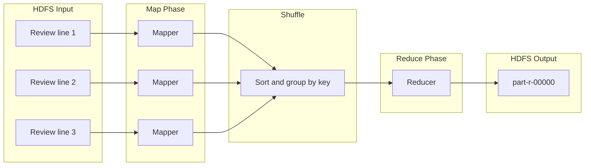
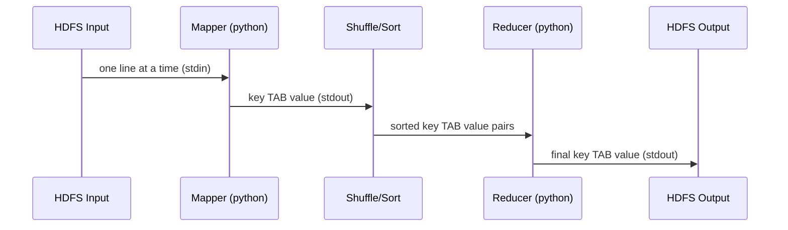
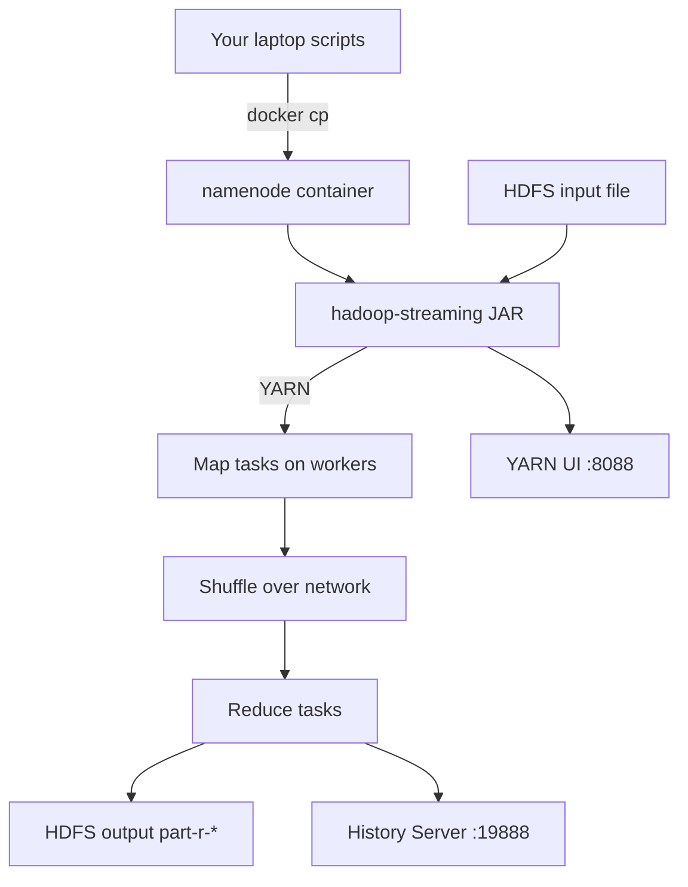

# MapReduce on Local Hadoop — Student Guide

**Follow this guide step by step.** You will write Python MapReduce jobs, run them on the Docker Hadoop cluster, and monitor them with YARN and the History Server.

**Project folder:** `hadoop-local-docker/`  
**Prerequisite:** Hadoop cluster running — complete [HADOOP-STUDENT-GUIDE.md](./HADOOP-STUDENT-GUIDE.md) Steps 1–4 first.  
**Interactive notebook:** [Hadoop-MapReduce-Guide.ipynb](./Hadoop-MapReduce-Guide.ipynb)  
**Module code:** `mapreduce/`

---

## What you will learn

| Skill | What it means |
|-------|----------------|
| MapReduce pattern | Split work into **map**, **shuffle**, **reduce** phases |
| Hadoop Streaming | Run Python mapper/reducer scripts on a real cluster |
| Job submission | Deploy scripts, submit via `hadoop-streaming` JAR |
| Job monitoring | Use CLI + web UIs to track running and finished jobs |

---

## Module layout

```
hadoop-local-docker/
├── MAPREDUCE-STUDENT-GUIDE.md       ← this file
├── Hadoop-MapReduce-Guide.ipynb     ← run cells in order
├── mapreduce/
│   ├── README.md
│   ├── local_simulation.py          ← test logic on laptop (no Hadoop)
│   ├── job_helpers.py               ← deploy + submit + monitor helpers
│   └── streaming/
│       ├── wordcount_mapper.py
│       ├── wordcount_reducer.py
│       ├── sentiment_mapper.py
│       └── sentiment_reducer.py
└── data/ecommerce/product_reviews.txt
```

---

## Step 1 — Understand MapReduce

**Scenario:** ShopStream wants to know which words appear most often in product reviews.

MapReduce processes large files in three phases:



| Phase | Who runs it | Your code? | Example |
|-------|-------------|------------|---------|
| **Map** | Parallel tasks on workers | Yes | `(delivery, 1)`, `(excellent, 1)` |
| **Shuffle** | Hadoop framework | No | Group all `delivery` keys together |
| **Reduce** | Parallel tasks on workers | Yes | Sum counts → `delivery  2` |

---

## Step 2 — Start Jupyter (optional but recommended)

From `hadoop-local-docker/`:

```bash
python3 -m venv .venv
source .venv/bin/activate          # Windows: .venv\Scripts\activate
pip install -r requirements-notebook.txt
jupyter notebook Hadoop-MapReduce-Guide.ipynb
```

Run each notebook cell **in order**. Markdown cells explain concepts; code cells run commands.

---

## Step 3 — Test the algorithm locally (no Docker)

Before using Hadoop, prove your logic works on your laptop.

Open a Python shell or run the first notebook cells:

```python
from pathlib import Path
from mapreduce.local_simulation import run_wordcount, top_n

lines = Path("data/ecommerce/product_reviews.txt").read_text().splitlines()
counts = run_wordcount(lines)
print(top_n(counts, 10))
```

**Expected:** A list of `(word, count)` pairs. Words like `delivery`, `headphones`, and `customer` should appear near the top.

This is the same algorithm Hadoop will run — just without distribution across workers.

---

## Step 4 — Understand mapper and reducer scripts

With **Hadoop Streaming**, map and reduce are separate programs connected by **stdin/stdout**:



| Script | Reads | Writes | Example line |
|--------|-------|--------|--------------|
| **Mapper** | Input text lines | `key\tvalue` | `delivery\t1` |
| **Reducer** | Sorted `(key, value)` | Final `key\tvalue` | `delivery\t2` |

Scripts are in `mapreduce/streaming/`:

- `wordcount_mapper.py` — split each line into words, emit `(word, 1)`
- `wordcount_reducer.py` — sum counts per word

> **Important:** The Docker Hadoop image uses **Python 2.7**. Scripts use `from __future__ import print_function` so they work both locally (Python 3) and in the cluster.

---

## Step 5 — Test the Unix pipeline on your laptop

Hadoop Streaming is equivalent to this shell pipeline. The `sort` command plays the **shuffle** role:

```bash
cat data/ecommerce/product_reviews.txt \
  | python3 mapreduce/streaming/wordcount_mapper.py \
  | sort \
  | python3 mapreduce/streaming/wordcount_reducer.py \
  | sort -t$'\t' -k2 -nr \
  | head -10
```

**Expected:** Output matches Step 3. If it does not, fix the mapper/reducer before submitting to Hadoop.

---

## Step 6 — Verify the Hadoop cluster

All 7 containers must be healthy before submitting jobs.

```bash
docker compose ps
docker exec resourcemanager yarn node -list
```

**Expected:**

- 7 containers with status `healthy`
- 3 YARN nodes in `RUNNING` state

Open these URLs in your browser (keep them open for monitoring):

| UI | URL | Purpose |
|----|-----|---------|
| YARN ResourceManager | http://localhost:8088 | Live applications |
| YARN Proxy | http://localhost:9099 | Per-app detail |
| MapReduce History | http://localhost:19888 | Finished job logs |
| HDFS NameNode | http://localhost:9870 | Browse input/output files |

---

## Step 7 — Upload input data to HDFS

MapReduce reads from **HDFS paths**, not your laptop filesystem.

```bash
docker exec namenode hdfs dfs -mkdir -p /shopstream/raw/reviews
docker exec namenode hdfs dfs -mkdir -p /shopstream/processed

docker cp data/ecommerce/product_reviews.txt namenode:/tmp/product_reviews.txt
docker exec namenode hdfs dfs -put -f /tmp/product_reviews.txt \
  /shopstream/raw/reviews/product_reviews.txt

docker exec namenode hdfs dfs -ls /shopstream/raw/reviews
```

**Expected:** File listed at `/shopstream/raw/reviews/product_reviews.txt` (~808 bytes).

---

## Step 8 — Deploy and submit your first MapReduce job

### 8.1 — Deploy scripts to the cluster

Copy mapper and reducer into the `namenode` container:

```bash
docker exec namenode mkdir -p /tmp/mapreduce-streaming
docker cp mapreduce/streaming/wordcount_mapper.py namenode:/tmp/mapreduce-streaming/
docker cp mapreduce/streaming/wordcount_reducer.py namenode:/tmp/mapreduce-streaming/
```

Or from the notebook / Python:

```python
from mapreduce.job_helpers import deploy_scripts
deploy_scripts("mapreduce/streaming", ["wordcount_mapper.py", "wordcount_reducer.py"])
```

### 8.2 — Remove old output (required before re-run)

```bash
docker exec namenode hdfs dfs -rm -r -f /shopstream/processed/python_wordcount
```

Hadoop fails if the output directory already exists.

### 8.3 — Submit the Hadoop Streaming job

```bash
docker exec namenode bash -lc '
  hadoop jar $(ls $HADOOP_HOME/share/hadoop/tools/lib/hadoop-streaming-*.jar | head -1) \
    -files /tmp/mapreduce-streaming/wordcount_mapper.py,/tmp/mapreduce-streaming/wordcount_reducer.py \
    -mapper "python wordcount_mapper.py" \
    -reducer "python wordcount_reducer.py" \
    -input /shopstream/raw/reviews/product_reviews.txt \
    -output /shopstream/processed/python_wordcount
'
```



**While the job runs**, watch for these log lines:

```
map 0% reduce 0%
map 100% reduce 0%
map 100% reduce 100%
Job ... completed successfully
```

In http://localhost:8088/cluster/apps the application moves: `ACCEPTED` → `RUNNING` → `FINISHED`.

### 8.4 — Read the output

```bash
docker exec namenode bash -lc \
  "hdfs dfs -cat /shopstream/processed/python_wordcount/part-* | sort -t\$'\t' -k2 -nr | head -15"
```

**Expected:** Tab-separated word counts, similar to Step 5.

---

## Step 9 — Monitor MapReduce jobs

### 9.1 — YARN CLI

```bash
# Running jobs
docker exec resourcemanager yarn application -list -appStates RUNNING

# Finished jobs
docker exec resourcemanager yarn application -list -appStates FINISHED

# Details for one application
docker exec resourcemanager yarn application -status application_XXXXXXXXX_XXXX
```

### 9.2 — Web UI checklist

| Step | URL | What to check |
|------|-----|---------------|
| 1 | http://localhost:8088/cluster/apps | Application state and progress |
| 2 | Click app → Tracking URL | Map/reduce task progress |
| 3 | http://localhost:19888/jobhistory | Counters and timeline for finished jobs |
| 4 | http://localhost:9870 → Browse filesystem | Output under `/shopstream/processed/` |

### 9.3 — Key job counters

| Counter | Meaning |
|---------|---------|
| `Map input records` | Lines read from HDFS |
| `Map output records` | `(key, value)` pairs emitted by mapper |
| `Reduce input groups` | Unique keys after shuffle |
| `Launched map tasks` | Number of parallel map containers |
| `Launched reduce tasks` | Number of parallel reduce containers |

---

## Step 10 — Run a second job (sentiment keywords)

**Question:** How many reviews contain positive vs negative keywords?

Scripts:

- `mapreduce/streaming/sentiment_mapper.py`
- `mapreduce/streaming/sentiment_reducer.py`

```python
from mapreduce.job_helpers import deploy_scripts, submit_streaming_job, read_hdfs_output

deploy_scripts("mapreduce/streaming", ["sentiment_mapper.py", "sentiment_reducer.py"])
submit_streaming_job(
    mapper="sentiment_mapper.py",
    reducer="sentiment_reducer.py",
    input_path="/shopstream/raw/reviews/product_reviews.txt",
    output_path="/shopstream/processed/review_sentiment",
)
read_hdfs_output("/shopstream/processed/review_sentiment")
```

**Expected:** Two lines like `positive\t10` and `negative\t6`. A single review can match both categories.

---

## Step 11 — Full job lifecycle

```
DEVELOP (laptop)                 DEPLOY (cluster)
────────────────                 ────────────────
1. Write mapper.py               1. Start Hadoop cluster
2. Write reducer.py              2. Upload input → HDFS
3. Test: cat | map | sort | red  3. docker cp scripts → namenode
4. Fix until output is correct   4. hadoop jar streaming.jar ...
                                 5. Monitor via 8088 / 19888
                                 6. Read part-r-* from HDFS
```

---

## Troubleshooting

| Problem | Cause | Fix |
|---------|-------|-----|
| `Output directory already exists` | Re-ran job without cleanup | `hdfs dfs -rm -r -f <output>` |
| `Connection refused` to ResourceManager | Cluster not ready | Wait; check `docker compose ps` |
| Empty reducer output | Mapper format wrong | Must emit `key\tvalue` |
| Python error in container | Python 3 syntax on Py 2.7 | Use scripts in `mapreduce/streaming/` as-is |
| Job stuck in ACCEPTED | Workers not registered | Check `yarn node -list` shows 3 RUNNING nodes |
| Results differ from local test | Skipped pipeline test | Re-run Step 5 before cluster submit |

---

## Map local cluster → AWS

| Local (this lab) | AWS equivalent |
|------------------|----------------|
| HDFS paths | Amazon S3 |
| `hadoop-streaming` JAR | Amazon EMR step |
| YARN UI (:8088) | EMR console / YARN on primary node |
| History Server (:19888) | EMR logs in S3 + CloudWatch |
| Python mapper/reducer | Same pattern on EMR; or use Spark/Glue in production |

---

## Quick reference

| Task | Command / file |
|------|----------------|
| Student notebook | [Hadoop-MapReduce-Guide.ipynb](./Hadoop-MapReduce-Guide.ipynb) |
| Cluster setup | [HADOOP-STUDENT-GUIDE.md](./HADOOP-STUDENT-GUIDE.md) |
| Module README | [mapreduce/README.md](./mapreduce/README.md) |
| Test locally | `mapreduce/local_simulation.py` |
| Submit from Python | `mapreduce/job_helpers.py` |
| Sample data | `data/ecommerce/product_reviews.txt` |
