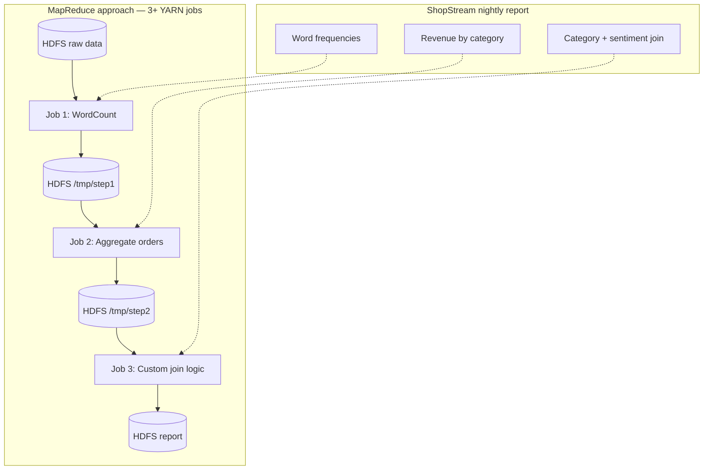
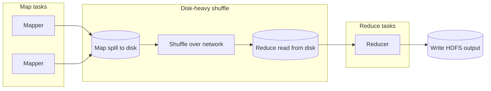
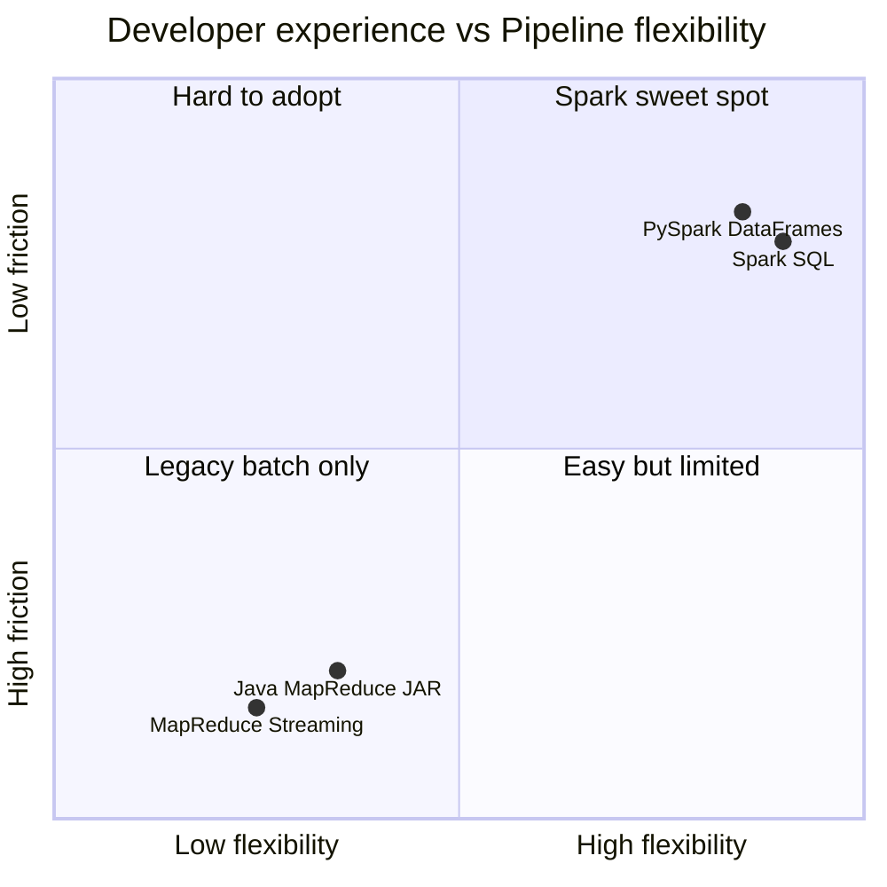
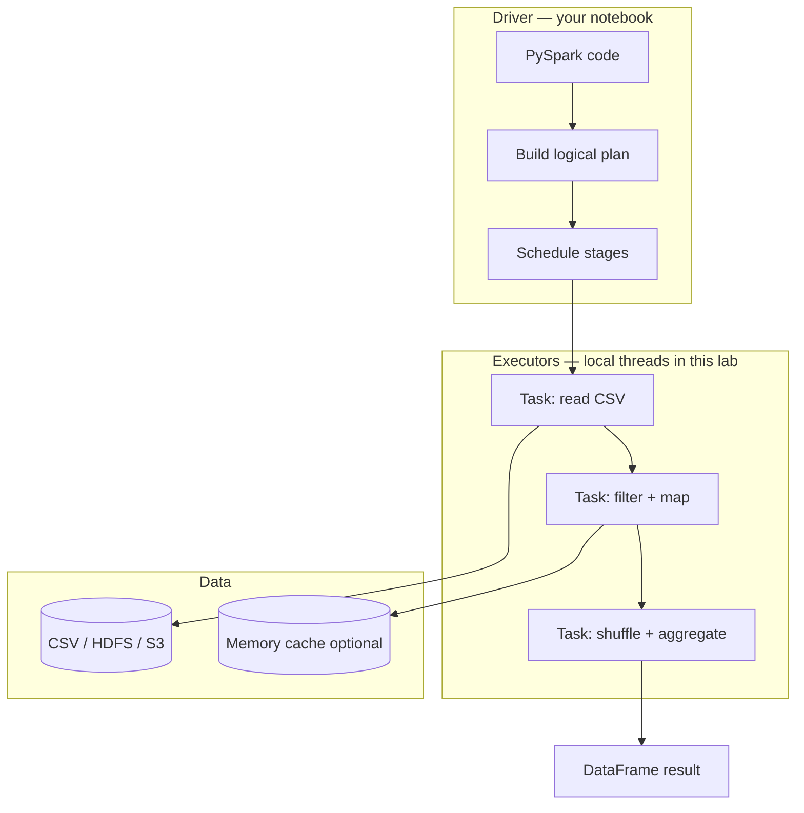
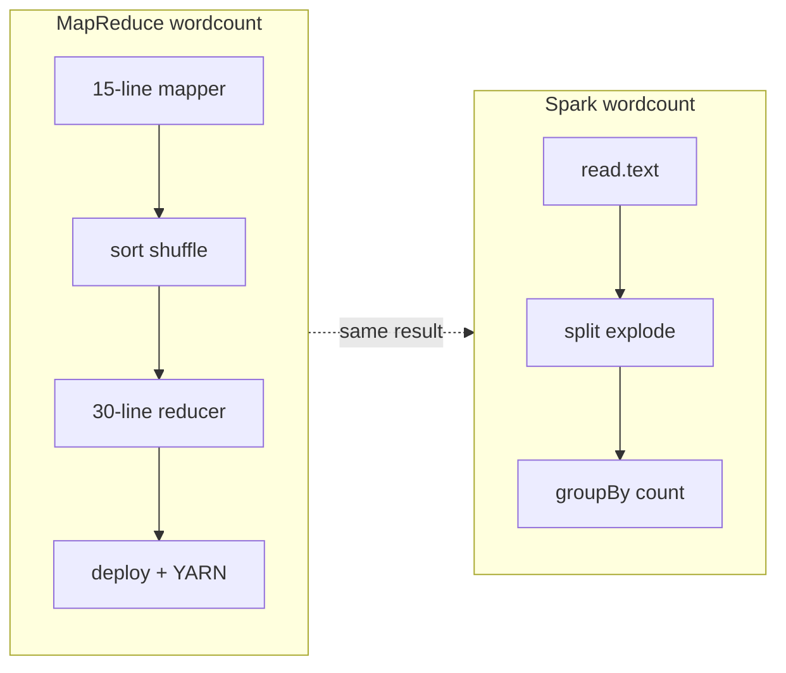
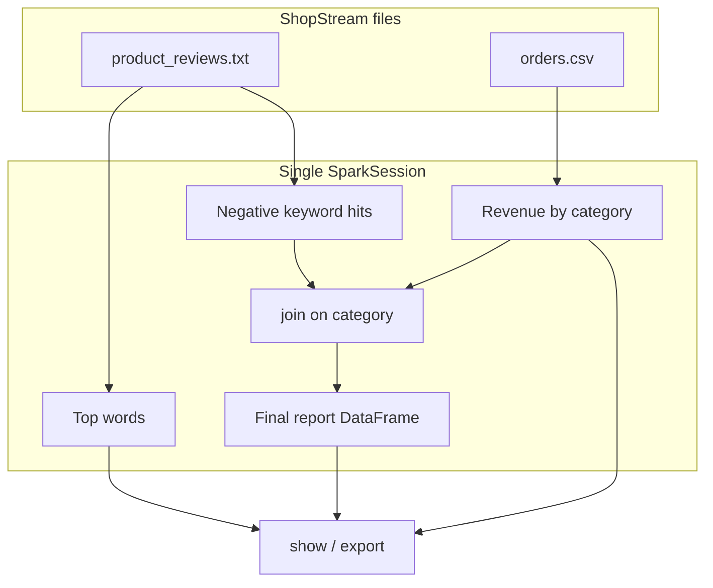
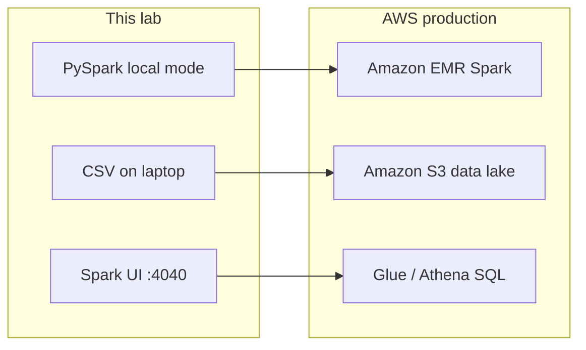

# Hadoop to Spark — Student Guide

**Follow this guide step by step.** You will see **why MapReduce becomes painful** for real analytics, then solve the same ShopStream problems with **PySpark**.

**Project folder:** `hadoop-local-docker/spark/`  
**Prerequisite:** [HADOOP-STUDENT-GUIDE.md](../HADOOP-STUDENT-GUIDE.md) + [MAPREDUCE-STUDENT-GUIDE.md](../MAPREDUCE-STUDENT-GUIDE.md)  
**Notebook:** [Spark-Pivot-Guide.ipynb](./Spark-Pivot-Guide.ipynb)

---

## What you will learn

| Topic | Outcome |
|-------|---------|
| MapReduce limits | Name the bottlenecks you hit in prior labs |
| Spark mental model | Driver, executors, DAG, lazy transformations |
| PySpark local mode | Run Spark on your laptop without YARN |
| Same analytics, less friction | One notebook replaces multiple MapReduce jobs |
| Production path | Map local Spark → Amazon EMR / Glue |

---

## Module layout

```
hadoop-local-docker/spark/
├── SPARK-STUDENT-GUIDE.md       ← this file
├── Spark-Pivot-Guide.ipynb      ← run cells in order
├── requirements-spark.txt
├── spark_helpers.py
├── hadoop_pain_points.py
└── README.md
```

Sample data (shared with Hadoop labs): `../data/ecommerce/`

---

## Step 1 — The business problem MapReduce struggles with

ShopStream's data team needs a **single nightly report** that combines:

| Source | Question |
|--------|----------|
| `product_reviews.txt` | Which words appear most often? |
| `orders.csv` | Revenue by product category? |
| Both | Which categories have the most negative review signals? |

In MapReduce, each step is typically a **separate batch job** with HDFS temp folders between steps.



**Pain you already felt in MapReduce labs:**

- Write mapper + reducer scripts per job
- `docker cp` deploy scripts before each submit
- Delete HDFS output paths before re-run
- Wait for YARN to launch containers per job
- Python 2.7 in the Hadoop Docker image for Streaming

---

## Step 2 — MapReduce architecture: where time goes

MapReduce is correct for massive batch scans, but the model has structural costs:



| Phase | Student-visible symptom |
|-------|-------------------------|
| Job submit | Log stalls at `ACCEPTED` while YARN allocates containers |
| Map | Progress `map 0% → 100%` |
| Shuffle | Counters show `Reduce shuffle bytes` — data moved and sorted |
| Reduce | Second progress bar `reduce 0% → 100%` |
| Next step | **Start over** with new scripts and new output path |

---

## Step 3 — Pain point checklist (Hadoop vs Spark)



| Pain point | MapReduce (our Docker lab) | Spark (this lab) |
|------------|----------------------------|------------------|
| Multi-step pipeline | 1 YARN app **per step** | 1 Spark app, chained transforms |
| Code layout | mapper.py + reducer.py + deploy | PySpark cells / one script |
| Iteration speed | Minutes per job submit | Seconds to rerun notebook |
| Joins & SQL | Manual or extra jobs | `join`, `groupBy`, Spark SQL |
| Python version | 2.7 in cluster Streaming | Python 3 PySpark locally |
| Interactive exploration | No | Notebook REPL + Spark UI |

Run in Python:

```python
from hadoop_pain_points import print_pain_summary
print_pain_summary()
```

---

## Step 4 — Spark mental model

Spark keeps the **distributed** idea but replaces rigid map-then-reduce-only with a **DAG of transformations**.



| Spark term | Meaning |
|------------|---------|
| **Driver** | Your notebook — builds the plan |
| **Executor** | Workers that run tasks (`local[*]` uses JVM threads on laptop) |
| **Transformation** | `filter`, `groupBy` — lazy, not executed yet |
| **Action** | `show`, `count`, `write` — triggers execution |
| **Stage** | Group of tasks separated by shuffle (like MapReduce boundary) |

---

## Step 5 — Environment setup

```bash
cd hadoop-local-docker/spark
python3 -m venv .venv
source .venv/bin/activate          # Windows: .venv\Scripts\activate
pip install -r requirements-spark.txt
jupyter notebook Spark-Pivot-Guide.ipynb
```

**Requirements:** Java 8+ (same JVM Hadoop uses).  
**Spark UI:** http://localhost:4040 while the session is active.

---

## Step 6 — Side-by-side: word count

### MapReduce (recap)

```bash
# Deploy scripts, submit streaming JAR, wait for YARN, read HDFS part-r-*
cat data | python mapper.py | sort | python reducer.py   # local test first
hadoop jar hadoop-streaming.jar ...                         # cluster submit
```

### Spark (this lab)

```python
from pyspark.sql import functions as F
from spark_helpers import create_spark, data_path, stop_spark

spark = create_spark()
reviews = spark.read.text(data_path("product_reviews.txt"))
(
    reviews.select(F.explode(F.split(F.lower(F.col("value")), r"\W+")).alias("word"))
    .where(F.col("word") != "")
    .groupBy("word")
    .count()
    .orderBy(F.desc("count"))
    .show(10, truncate=False)
)
stop_spark(spark)
```



---

## Step 7 — Multi-step pipeline in ONE Spark program

This is the pivot moment: three analytics questions, **no intermediate HDFS folders**.



The notebook runs all three analyses without submitting new YARN MapReduce jobs.

---

## Step 8 — Monitor Spark

| Tool | URL | Use |
|------|-----|-----|
| Spark UI | http://localhost:4040 | Jobs, stages, shuffle read/write |
| Executors tab | Spark UI | Memory, task time |
| SQL tab | Spark UI | Query plan for DataFrame operations |

Compare to Hadoop monitoring:

| Hadoop | Spark |
|--------|-------|
| YARN http://localhost:8088 | Spark UI http://localhost:4040 |
| History Server http://localhost:19888 | Completed jobs in Spark UI |
| Per-job counters in logs | Stage-level metrics + DAG visualization |

---

## Step 9 — When Hadoop still wins (be honest)

Spark is not a drop-in replacement for every workload.

| Keep MapReduce / HDFS | Prefer Spark |
|-----------------------|--------------|
| Simple one-pass batch scan at huge scale | Iterative analytics, joins, ML features |
| Legacy EMR 4.x jobs | Modern EMR / Glue / Databricks |
| Ultra-cheap cold batch once per day | Interactive exploration + multi-step pipelines |

In production both often coexist: **HDFS or S3 for storage**, **Spark for compute**.

---

## Step 10 — Map local lab → AWS



| Local | AWS |
|-------|-----|
| `SparkSession` local[*] | EMR cluster or Glue Spark job |
| `../data/ecommerce/*.csv` | `s3://shopstream/raw/` |
| Spark UI :4040 | EMR Spark History Server + CloudWatch |
| MapReduce on Docker | EMR step (legacy) or skip entirely |

---

## Troubleshooting

| Problem | Fix |
|---------|-----|
| `Java not found` | Install JDK 8+; verify `java -version` |
| PySpark import error | `pip install -r requirements-spark.txt` inside venv |
| Spark UI not loading | Run a cell that creates `SparkSession` first |
| Out of memory | `.master("local[2]")` or reduce data size |
| Hadoop cluster not needed | Spark local lab reads CSV from `../data/ecommerce/` |

---

## Quick reference

| Resource | Path |
|----------|------|
| Notebook | [Spark-Pivot-Guide.ipynb](./Spark-Pivot-Guide.ipynb) |
| MapReduce lab | [../MAPREDUCE-STUDENT-GUIDE.md](../MAPREDUCE-STUDENT-GUIDE.md) |
| Cluster setup | [../HADOOP-STUDENT-GUIDE.md](../HADOOP-STUDENT-GUIDE.md) |
